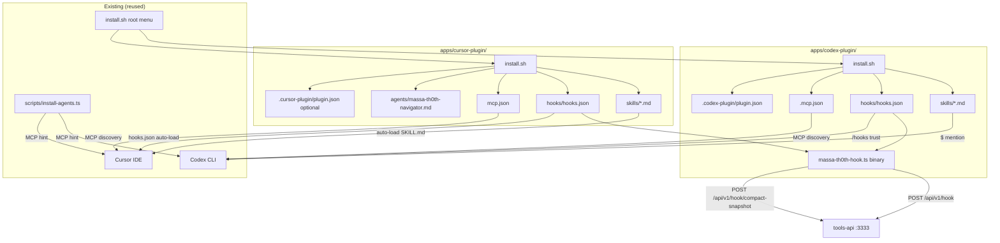

# Codex + Cursor Plugin Parity Design

**Spec**: `.specs/features/codex-cursor-plugin-parity/spec.md`
**Status**: Draft

---

## Design Summary

Create two new app packages — `apps/codex-plugin/` and `apps/cursor-plugin/` — as native plugin bundles matching each tool's manifest/discovery system. Both reuse the existing `massa-th0th-hook.ts` binary (no new hook logic), the existing 6 slash commands (as `SKILL.md`/skill files), and the existing MCP server entry. Both auto-write hook configs into the user's HOME with the ownership-marker + backup + consent-gate conventions from `install-agents.ts`, using a hooks-specific array-append merge (not `deepMerge`). The root `install.sh`, `README.md`, `.env.example`, and `install-agents.ts` hint are updated for discoverability.

---

## Requirements Traceability

| Requirement ID | Design component(s) |
| --- | --- |
| CPX-01,02 | `apps/codex-plugin/install.sh` (user/project scope plugin dir creation) |
| CPX-03 | `apps/codex-plugin/skills/*.md` (6 SKILL.md files) |
| CPX-04 | `apps/codex-plugin/.mcp.json` + deconfliction hint |
| CPX-05 | `apps/codex-plugin/hooks/hooks.json` (6 Codex events) + reuse `massa-th0th-hook.ts` + trust warning |
| CPX-06 | pre-compact subcommand (already in binary) |
| CPX-07 | `apps/codex-plugin/install.sh --uninstall` (ownership-marker removal) |
| CPX-08 | binary silent-exit-0 on 423 (already in binary) |
| CRS-01,02 | `apps/cursor-plugin/install.sh` (user/project scope plugin dir creation) |
| CRS-03 | `apps/cursor-plugin/hooks/hooks.json` (7 Cursor events incl. sessionStart + preCompact) |
| CRS-04 | `apps/cursor-plugin/mcp.json` + deconfliction hint |
| CRS-05 | pre-compact subcommand (already in binary) |
| CRS-06 | sessionStart event in hooks.json |
| CRS-07 | `apps/cursor-plugin/install.sh --uninstall` |
| CRS-08 | directory layout matching `vscode.cursor.plugins.registerPath` auto-discovery |
| INS-01,02 | root `install.sh` menu additions |
| INS-03 | `scripts/install-agents.ts` hint print |
| INS-04 | `README.md` integration section |
| INS-05 | `.env.example` stale-note removal |
| INS-06,07 | root `install.sh` plugin menu extension (4 tools) + Claude/OpenCode installers wired |
| INS-08 | `apps/claude-plugin/install.sh` hooks auto-write extension |
| INS-09 | OpenCode plugin menu install (npm/source + config snippet) |
| INS-10 | `install-agents.ts` Claude/OpenCode deconfliction hints |
| INS-11,12 | README + docs update for 4-plugin parity |

---

## Current Codebase Evidence

Inspected in this session (file:line pointers):

- `apps/claude-plugin/install.sh:1-59` — script-copy installer pattern (no npm). `--user`/`--project` scope, copies `commands/*.md` prefixed `massa-th0th-` + `agents/`, does NOT copy hooks.
- `apps/claude-plugin/settings.json.template:1-68` — ready-to-merge hooks block with `${CLAUDE_PLUGIN_ROOT}` placeholder + 5-event wiring + `permissions.allow` list.
- `apps/claude-plugin/hooks/massa-th0th-hook.ts:36-42` — `EVENT_MAP` (5 keys: `session-start`, `user-prompt-submit`, `post-tool-use`, `pre-compact`, `stop`). `:61-111` pin resolution. `:249-274` pre-compact dual-POST (3s obs + 5s snapshot). `:275-289` single POST 2s. `:293` always exit 0.
- `apps/claude-plugin/commands/{map,index,find,def,graph,status}.md` — 6 slash commands with YAML frontmatter + prompt body.
- `apps/claude-plugin/agents/massa-th0th-navigator.md:1-29` — subagent.
- `apps/opencode-plugin/package.json:1-47` — npm package pattern (`@massa-th0th/opencode-plugin@1.1.0`, `main: dist/index.js`, deps `@opencode-ai/plugin`).
- `apps/opencode-plugin/src/index.ts:118-770` — Plugin interface (tools + lifecycle handlers).
- `scripts/install-agents.ts:40-42` — `OWNED_MARKER = "_massaTh0thOwned"`, `MASSA_TH0TH_OWNED_KEY = "massa-th0th"`. `:45-50` `AgentName` union. `:144` `deepMerge` (arrays replaced, not concatenated — F5 risk). `:194-294` `JsonMcpWriter` (backup + plan/apply/uninstall). `:493-522` `assertHomeWriteConsent`. `:391-465` `CodexWriter` (TOML, `~/.codex/config.toml`). `:312-317` `CursorWriter` (`~/.cursor/mcp.json`).
- Root `install.sh:484-577` — `print_hooks_guide` (prints, never writes; Codex 5 events, Cursor 3 events — OUT OF DATE).
- `packages/shared/src/config/index.ts:670` — `HOOKS_ENABLED` default true, disabled → 423.
- `packages/core/src/services/hooks/hook-service.ts:94-102` — `LIFECYCLE_EVENTS` = 6 kinds.

Active STATE.md decisions checked: AD-007 (sandbox auto), AD-008 (json_schema), AD-009 (D5 Cypher removal). None conflict. No new project-level AD needed.

---

## Architecture Overview

### Approach exploration (Large/Complex)

**Approach A (recommended): Script-copy bundles matching claude-plugin pattern.** Both `apps/codex-plugin/` and `apps/cursor-plugin/` are directory bundles with NO `package.json` — versioned by repo/git. Each has an `install.sh` that copies skills + agents + hook scripts and auto-writes the hooks config. Reuses the `massa-th0th-hook.ts` binary from `apps/claude-plugin/hooks/` via symlink or path reference. Plugin discovery via Codex `/plugins` (local dir) and Cursor `registerPath` (directory auto-discovery).

**Approach B: npm packages matching opencode-plugin pattern.** `@massa-th0th/codex-plugin` and `@massa-th0th/cursor-plugin` as npm packages. Requires a host plugin SDK (`@opencode-ai/plugin` equivalent). Codex has no official npm plugin SDK (`@codex-native/sdk` is third-party, rejected). Cursor has `@cursor/sdk` but it's for headless agents, not in-editor plugin registration. This approach adds a build/publish step and a dependency on host SDKs that may not fit the bundle model.

**Approach C: Hybrid — npm for Cursor (VS Code extension), script-copy for Codex.** Ship a compiled `.vsix` for Cursor using `vscode.cursor.plugins.registerPath` in an extension `activate()` function, and a script-copy bundle for Codex. More robust for Cursor (programmatic registration) but adds a VS Code extension build pipeline (esbuild/vite, `.vsix` packaging) that the project doesn't currently have.

**Recommendation: Approach A.** It matches the existing `apps/claude-plugin` pattern (proven, no new build pipeline), requires no npm publish, and both tools' discovery systems support directory bundles (Codex local plugin dir, Cursor `registerPath` auto-discovery of `skills/`, `hooks/hooks.json`, `mcp.json`). The `vscode.cursor.plugins.registerPath` can be called by a tiny one-liner VS Code extension OR the user can copy the directory to `~/.cursor/plugins/local/` for auto-discovery — we document both paths. The binary is reused as-is.

**Chosen by user confirmation of the spec** (which specified directory bundles, not npm packages).



---

## Code Reuse Analysis

### Existing Components to Leverage

| Component | Location | How to Use |
| --- | --- | --- |
| `massa-th0th-hook.ts` binary | `apps/claude-plugin/hooks/massa-th0th-hook.ts` | Symlink or path-reference from both new plugin dirs; no code change needed (EVENT_MAP already covers the 5 mappable Claude events; Codex/Cursor map onto the same 5 subcommands) |
| 6 slash command `.md` files | `apps/claude-plugin/commands/{map,index,find,def,graph,status}.md` | Copy content into `skills/` as `SKILL.md` files (Codex skill format) and `skills/<name>/SKILL.md` (Cursor skill format); adapt frontmatter per host |
| `massa-th0th-navigator.md` subagent | `apps/claude-plugin/agents/massa-th0th-navigator.md` | Copy into `apps/cursor-plugin/agents/` (Cursor auto-discovers `agents/`); Codex has no subagent concept → skip |
| `OWNED_MARKER` + backup + consent pattern | `scripts/install-agents.ts:40-42,194-294,493-522` | Extract the backup + ownership-marker + `assertHomeWriteConsent` logic into a shared helper sourced by both new `install.sh` scripts; for hooks.json specifically, use array-append merge instead of `deepMerge` |
| `print_hooks_guide` Codex/Cursor blocks | root `install.sh:537-567` | Replace the print-only guide with auto-write in the new installers; the root `print_hooks_guide` can still print as a fallback for users who don't run the plugin installer |

### Integration Points

| System | Integration Method |
| --- | --- |
| tools-api (`:3333`) | Binary POSTs to `/api/v1/hook`, `/api/v1/hook/batch`, `/api/v1/hook/compact-snapshot` — unchanged |
| Codex `/plugins` discovery | Plugin dir with `.codex-plugin/plugin.json` manifest + `skills/` + `hooks/` + `.mcp.json` |
| Cursor `registerPath` discovery | Plugin dir with `skills/`, `hooks/hooks.json`, `mcp.json`, `agents/`, `commands/` (`.cursor-plugin/plugin.json` optional) |
| `install-agents.ts` MCP config | Separate files (`~/.codex/config.toml`, `~/.cursor/mcp.json`) — no collision with plugin's bundled `.mcp.json`/`mcp.json` but deconfliction hint printed |
| Hook config files | `~/.codex/hooks.json` (Codex) and `~/.cursor/hooks.json` (Cursor) — auto-written with array-append merge |

---

## Components

### apps/codex-plugin/

- **Purpose**: Native Codex plugin bundle — skills + hooks + MCP manifest for Codex CLI.
- **Location**: `apps/codex-plugin/`
- **Structure**:
  ```
  apps/codex-plugin/
  ├── README.md
  ├── install.sh                    # bash, idempotent, --user/--project/--uninstall
  ├── .codex-plugin/
  │   └── plugin.json               # manifest: name, version, description, skills, mcp, hooks
  ├── skills/
  │   ├── map.md                    # adapted from claude-plugin/commands/map.md (SKILL.md frontmatter)
  │   ├── index.md
  │   ├── find.md
  │   ├── def.md
  │   ├── graph.md
  │   └── status.md
  ├── hooks/
  │   ├── hooks.json                # 6 Codex events → binary subcommands
  │   └── massa-th0th-hook          # symlink to ../../claude-plugin/hooks/massa-th0th-hook.ts
  └── .mcp.json                     # MCP server: npx @massa-th0th/mcp-client
  ```
- **Interfaces**:
  - `install.sh --user` → `~/.codex/plugins/massa-th0th/` (copy) + `~/.codex/hooks.json` (merge)
  - `install.sh --project` → `./.codex/plugins/massa-th0th/` (copy) + `./.codex/hooks.json` (merge)
  - `install.sh --uninstall` → remove owned plugin dir + owned hooks entries
- **Dependencies**: `apps/claude-plugin/hooks/massa-th0th-hook.ts` (symlinked), `scripts/banner.sh` (banner)
- **Reuses**: binary (no change), command content (adapted to SKILL.md), install-agents.ts merge conventions

### apps/cursor-plugin/

- **Purpose**: Native Cursor plugin bundle — skills + hooks + MCP + agents for Cursor IDE.
- **Location**: `apps/cursor-plugin/`
- **Structure**:
  ```
  apps/cursor-plugin/
  ├── README.md
  ├── install.sh
  ├── skills/
  │   ├── map/SKILL.md
  │   ├── index/SKILL.md
  │   ├── find/SKILL.md
  │   ├── def/SKILL.md
  │   ├── graph/SKILL.md
  │   └── status/SKILL.md
  ├── hooks/
  │   ├── hooks.json                # 7 Cursor events → binary subcommands
  │   └── massa-th0th-hook          # symlink
  ├── mcp.json                      # MCP server
  ├── agents/
  │   └── massa-th0th-navigator.md  # copied from claude-plugin
  └── .cursor-plugin/
      └── plugin.json               # optional manifest (Cursor auto-discovers without it)
  ```
- **Interfaces**:
  - `install.sh --user` → `~/.cursor/plugins/massa-th0th/` (copy) + `~/.cursor/hooks.json` (merge)
  - `install.sh --project` → `./.cursor/plugins/massa-th0th/` (copy) + `./.cursor/hooks.json` (merge)
  - `install.sh --uninstall` → remove owned plugin dir + owned hooks entries
  - User can also register via `vscode.cursor.plugins.registerPath("/abs/path/to/apps/cursor-plugin")` from a VS Code extension (documented in README)
- **Dependencies**: `apps/claude-plugin/hooks/massa-th0th-hook.ts` (symlinked), `scripts/banner.sh`
- **Reuses**: binary (no change), command content (adapted to SKILL.md), navigator subagent (copied), install-agents.ts merge conventions

### hooks.json merge helper (shared)

- **Purpose**: Array-append/remove merge for hooks.json that preserves user hooks.
- **Location**: `scripts/hooks-config-merge.sh` (sourced by both `install.sh` scripts) OR inlined in each `install.sh` (kept simple to avoid a new shared dep).
- **Interfaces**:
  - `merge_hook_entry <file> <event> <command_json>` — append the massa-th0th hook to the event's array if no owned entry exists; backup first
  - `remove_owned_hooks <file>` — remove all entries with `_massaTh0thOwned: true` from all events
- **Decision: inline in each install.sh** (they're small, ~20 lines each; a shared sourced script adds a path-dependency that bash `source` resolves differently across scopes). Both scripts implement the same logic. Tests cover both.
- **Reuses**: ownership marker `_massaTh0thOwned` from `install-agents.ts:41`, backup pattern from `:173-184`

### Root install.sh menu + install-agents.ts hint

- **Purpose**: Discoverability — wire the new plugins into the root installer menu and print a deconfliction hint.
- **Location**: root `install.sh` (menu section ~`:620`), `scripts/install-agents.ts` (Codex/Cursor writer apply methods)
- **Interfaces**: menu choice → invoke `apps/codex-plugin/install.sh` / `apps/cursor-plugin/install.sh` with the same scope flag
- **Reuses**: existing menu infrastructure

### Phase 4: Claude Code hooks auto-write + OpenCode menu + four-plugin menu

- **Purpose**: Extend the plugin installer parity to all four supported tools: Claude Code, Codex, Cursor, OpenCode.
- **Location**: `apps/claude-plugin/install.sh` (extend), root `install.sh` `install_plugins_menu()` (extend), `scripts/install-agents.ts` (Claude/OpenCode hints), `README.md` (update)
- **Components**:
  - **Claude Code hooks auto-write**: Extend `apps/claude-plugin/install.sh` to merge the hooks block into `~/.claude/settings.json` (or project `.claude/settings.json`) using array-append + `_massaTh0thOwned` marker + backup. The hooks block uses Claude's nested matcher-group + `hooks[]` form (5 events: SessionStart, UserPromptSubmit, PostToolUse, PreCompact, Stop). Each hook command is `bun run "<plugin-dir>/hooks/massa-th0th-hook.ts" <subcommand>`. The merge uses `bun -e` or `node -e` for JSON manipulation (same as Codex/Cursor installers).
  - **OpenCode menu install**: The root `install_plugins_menu()` OpenCode option prints the `npm install @massa-th0th/opencode-plugin` command and the `opencode.json` config snippet (or, from source, `bun add` + config). No hooks.json auto-write — OpenCode hooks are in-process via the Plugin API.
  - **Four-plugin menu**: Extend `install_plugins_menu()` from 3 options (Codex/Cursor/Both) to 5 (Claude/Codex/Cursor/OpenCode/All four).
  - **install-agents.ts hints**: Add deconfliction hints to `ClaudeCodeWriter.apply()` and `OpenCodeWriter.apply()` (same pattern as Codex/Cursor from T12).
- **Interfaces**:
  - `install.sh --user` (Claude) → copies commands/agents to `~/.claude/` AND merges hooks into `~/.claude/settings.json`
  - `install.sh --project` (Claude) → copies to `./.claude/` AND merges hooks into `./.claude/settings.json`
  - `install.sh --uninstall` (Claude) → removes owned hooks entries + commands/agents
  - Root menu "All four" → invokes all 4 installers in sequence
- **Reuses**: Codex/Cursor installer patterns (array-append merge, backup, ownership marker); existing `apps/claude-plugin/install.sh` command/agent copy; OpenCode npm package

---

## Data Models

No new database models. The hook observation payload is unchanged (`{ event, projectId, sessionId?, payload, cwd }`). The hooks.json config files use the host-native schema:

### Codex hooks.json

```json
{
  "SessionStart": [{ "type": "command", "command": "<plugin-dir>/hooks/massa-th0th-hook session-start", "_massaTh0thOwned": true }],
  "UserPromptSubmit": [{ "type": "command", "command": "<plugin-dir>/hooks/massa-th0th-hook user-prompt-submit", "_massaTh0thOwned": true }],
  "PreToolUse": [{ "type": "command", "command": "<plugin-dir>/hooks/massa-th0th-hook pre-tool-use", "_massaTh0thOwned": true }],
  "PostToolUse": [{ "type": "command", "command": "<plugin-dir>/hooks/massa-th0th-hook post-tool-use", "_massaTh0thOwned": true }],
  "PreCompact": [{ "type": "command", "command": "<plugin-dir>/hooks/massa-th0th-hook pre-compact", "_massaTh0thOwned": true }],
  "Stop": [{ "type": "command", "command": "<plugin-dir>/hooks/massa-th0th-hook stop", "_massaTh0thOwned": true }]
}
```

### Cursor hooks.json

```json
{
  "version": 1,
  "hooks": {
    "sessionStart": [{ "command": "<plugin-dir>/hooks/massa-th0th-hook session-start", "_massaTh0thOwned": true }],
    "sessionEnd": [{ "command": "<plugin-dir>/hooks/massa-th0th-hook stop", "_massaTh0thOwned": true }],
    "beforeSubmitPrompt": [{ "command": "<plugin-dir>/hooks/massa-th0th-hook user-prompt-submit", "_massaTh0thOwned": true }],
    "preToolUse": [{ "command": "<plugin-dir>/hooks/massa-th0th-hook pre-tool-use", "_massaTh0thOwned": true }],
    "postToolUse": [{ "command": "<plugin-dir>/hooks/massa-th0th-hook post-tool-use", "_massaTh0thOwned": true }],
    "preCompact": [{ "command": "<plugin-dir>/hooks/massa-th0th-hook pre-compact", "_massaTh0thOwned": true }],
    "stop": [{ "command": "<plugin-dir>/hooks/massa-th0th-hook stop", "_massaTh0thOwned": true }]
  }
}
```

### Binary EVENT_MAP extension (NOT needed)

The existing `EVENT_MAP` (`massa-th0th-hook.ts:36-42`) already has the 5 subcommands we need: `session-start`, `user-prompt-submit`, `post-tool-use`, `pre-compact`, `stop`. We need to add ONE entry for `pre-tool-use` (maps to `pre-tool-use` lifecycle kind, which the API accepts). This is a 1-line addition to the binary's `EVENT_MAP` — but the binary is in `apps/claude-plugin/hooks/`. **Decision: add `pre-tool-use` to the shared binary's EVENT_MAP** (it's a valid lifecycle kind the API accepts, and Claude Code may gain a pre-tool hook later). This is the only binary change.

### .codex-plugin/plugin.json manifest

```json
{
  "name": "massa-th0th",
  "version": "1.0.0",
  "description": "massa-th0th — semantic code search, memory, and context compression for Codex",
  "skills": ["skills/"],
  "mcp": ".mcp.json",
  "hooks": "hooks/hooks.json"
}
```

### .cursor-plugin/plugin.json (optional)

```json
{
  "name": "massa-th0th",
  "version": "1.0.0",
  "description": "massa-th0th — semantic code search, memory, and context compression for Cursor"
}
```

(Cursor auto-discovers `skills/`, `hooks/hooks.json`, `mcp.json`, `agents/` without a manifest, but including one is harmless and aids marketplace submission later.)

---

## Error Handling Strategy

| Error Scenario | Handling | User Impact |
| --- | --- | --- |
| tools-api unreachable | Binary POST fails within 2-5s timeout, exits 0 | No observation stored; agent not blocked |
| `HOOKS_ENABLED=false` → 423 | Binary receives 423, exits 0 | No observation; breadcrumb-on-fire log if deadline exceeded |
| Queue saturated → 429 | Binary receives 429, exits 0 | No observation; retry on next hook fire |
| Payload > 65536 → 413 | Binary receives 413, exits 0 | No observation |
| Codex hooks untrusted | Hooks never fire until `/hooks` run | Installer prints blocking warning |
| User has existing hooks in hooks.json | Array-append merge preserves user entries | User's hooks + massa-th0th hooks coexist |
| Re-install (no changes) | Ownership marker detects existing → no-op | Idempotent |
| `git rev-parse` fails (not a repo) | Binary falls back to cwd basename | Observation still POSTs with cwd-derived projectId |
| Symlink target missing (binary moved) | Hook command fails → exit non-zero → host fail-opens (Cursor) or skips (Codex) | No observation; installer verifies symlink on install |

---

## Risks & Concerns

| Concern | Location (file:line) | Impact | Mitigation |
| --- | --- | --- | --- |
| F2: Codex trust gate — hooks won't fire until `/hooks` run | Codex docs | Silent zero observations for users who skip `/hooks` | Installer prints blocking warning; README documents the step |
| F4: MCP double-registration if user runs both `install-agents.ts` and the plugin installer | `install-agents.ts:391-465` + plugin `.mcp.json` | Duplicate MCP server processes or name collision | Both installers print a deconfliction hint; plugin's `.mcp.json` is the canonical source when plugin is installed |
| F5: `deepMerge` replaces arrays — would clobber user hooks | `scripts/install-agents.ts:144` | User's existing hooks.json entries lost | New installers use hooks-specific array-append merge (not `deepMerge`); backup before write |
| Binary symlink could break if repo moves | `apps/codex-plugin/hooks/massa-th0th-hook` (symlink) | Hook command fails | Installer verifies symlink resolves on install; README documents `CLAUDE_PLUGIN_ROOT` equivalent |
| `EVENT_MAP` missing `pre-tool-use` | `apps/claude-plugin/hooks/massa-th0th-hook.ts:36-42` | `pre-tool-use` subcommand silently exits 0 (no POST) | Add `"pre-tool-use": "pre-tool-use"` to EVENT_MAP (1-line change to shared binary) |
| Cursor `registerPath` requires a VS Code extension to call it | `cursor.com/docs/extension-api` | Users who don't write an extension can't use programmatic registration | Document the `~/.cursor/plugins/local/` copy path as the default; `registerPath` is the advanced path for extension authors |
| Codex `plugin.json` schema may evolve | `developers.openai.com/codex/build-plugins` | Future Codex versions may require new fields | Manifest is minimal; README notes the docs URL for updates |

---

## Verification Design

### How tests prove each high-risk requirement

| Requirement | Verification |
| --- | --- |
| CPX-05 (hooks fire + POST) | Unit test: `echo '{}' | bun apps/claude-plugin/hooks/massa-th0th-hook.ts session-start` against a mock API → assert POST received + exit 0. Extend `apps/claude-plugin/hooks/__tests__/massa-th0th-hook.test.ts` with `pre-tool-use` subcommand. |
| CPX-07/CRS-07 (uninstall removes only owned) | Test: install into temp HOME with pre-existing user hook → uninstall → assert user hook survives, massa-th0th entries gone |
| F5 (array merge preserves user hooks) | Test: create `~/.codex/hooks.json` with user `SessionStart` hook (no marker) → run installer → assert both user + massa-th0th entries present |
| CPX-06/CRS-05 (pre-compact dual-POST) | Existing test `massa-th0th-hook.test.ts` covers this; verify the new hooks.json routes `PreCompact`/`preCompact` to the `pre-compact` subcommand |
| CRS-03/CRS-06 (sessionStart + preCompact wired) | Test: assert `apps/cursor-plugin/hooks/hooks.json` contains `sessionStart` and `preCompact` keys pointing at the binary |
| Binary EVENT_MAP extension | Test: `pre-tool-use` subcommand produces a POST (add to `massa-th0th-hook.test.ts`) |
| Installer idempotency | Test: run `install.sh` twice → no diff in target files/hooks.json |
| MCP deconfliction hint | Test: grep `install.sh` output for the hint text when both paths could run |

### Gate check commands

- `bun test apps/claude-plugin/hooks/__tests__/` — binary tests (extended)
- `bun test apps/codex-plugin/__tests__/` — new Codex installer tests
- `bun test apps/cursor-plugin/__tests__/` — new Cursor installer tests
- `bun run type-check` — 6/6 (no TS changes except optional manifest types)
- `bun run build` — 5/5 (no new build targets; these are script packages)
- `bash apps/codex-plugin/install.sh --dry-run` / `--uninstall` — installer smoke

---

## Tech Decisions

| Decision | Choice | Rationale |
| --- | --- | --- |
| Plugin shape | Directory bundles (no npm package) | Matches claude-plugin; both tools support directory discovery; no new build pipeline |
| Binary reuse | Symlink to `apps/claude-plugin/hooks/massa-th0th-hook.ts` | No code duplication; single source of truth; Wave 6 N30 made it platform-neutral |
| hooks.json merge | Array-append (not `deepMerge`) | `deepMerge` replaces arrays → would clobber user hooks (F5) |
| `pre-tool-use` in EVENT_MAP | Add 1 entry to the shared binary | Needed for Codex `PreToolUse` and Cursor `preToolUse`; API accepts `pre-tool-use` kind |
| Installer conventions | Backup + `_massaTh0thOwned` marker + consent gate | Matches `install-agents.ts`; safe HOME writes |
| No new project-level AD | Feature-local decisions only | No project-wide convention set; claude-plugin pattern is already the precedent |

> No project-level decisions to append to STATE.md. All decisions here are feature-local.

---

## Done

Design is done when: Approach A is confirmed (via spec confirmation), all 28 requirements map to components, F2-F5 mitigations are explicit, the binary's 1-line EVENT_MAP extension is identified, verification paths exist for every high-risk requirement, and Phase 4 extends the four-plugin installer parity with Claude Code hooks auto-write and OpenCode menu integration.