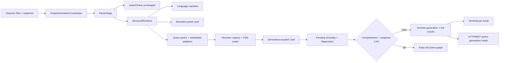

# Multi-Language Tree-sitter Breadth Design

**Spec:** `.specs/features/multi-language-tree-sitter-breadth/spec.md`  
**Context:** `.specs/features/multi-language-tree-sitter-breadth/context.md`  
**Status:** Approved by supplied plan plus completed full pre-mortem revisions

## Design Summary

Add a repository-owned structural engine under `packages/core/src/services/structural/`. A 33-entry manifest loads pinned native grammar artifacts, a bounded parser pool produces syntax trees, declarative query packs normalize symbols/edges/diagnostics, language resolvers bind syntax-only targets, a versioned FQN codec owns identity, and embedded adapters remap Vue/Markdown child spans. `ParseStage` keeps `smartChunk` unchanged and delegates only structural work; `ResolveStage` delegates language-aware resolution.

Persist structural results into generation-scoped PostgreSQL rows. A `GraphGenerationCoordinator` owns a per-project database lease, immutable input snapshot, pending build, centrality, completeness gate, CAS activation, synchronous workspace/job ordering, and cleanup. All public graph reads select the workspace's active generation. Semantic/vector/keyword behavior remains outside graph generation.



## Approach Tradeoffs

### Selected: pinned native grammar packages plus repository query packs

- Exact grammar packages/commits are recorded per manifest entry and lockfile.
- Native load happens in-process with direct syntax-tree/query access.
- Repository code owns normalized contracts, capability tiers, FQNs, spans, resolvers, diagnostics, and compatibility.
- Builder-only compilation and explicit lifecycle trust satisfy offline/runtime constraints.
- This is the approach specified by `plan-multi-language.md`; production changes remain gated until macOS arm64 native feasibility passes.

### Rejected: precompiled multi-language pack

- Reduces package count and ABI coordination.
- Current candidate packs use runtime grammar downloads/caches or expose a higher-level extraction contract, which violates frozen-offline readiness and weakens repository ownership of query packs.

### Rejected: `web-tree-sitter` plus WASM assets

- Portable runtime.
- Not native Tree-sitter as requested; changes performance, packaging, and memory premises. It is not a silent fallback if native feasibility fails.

## Current Codebase Evidence

| Evidence | Current behavior | Design consequence |
| --- | --- | --- |
| `packages/shared/src/config/index.ts:311` | 33 unique default extensions | Manifest exhaustiveness derives from this single source of truth. |
| `packages/core/src/services/etl/stages/parse.ts:152` | Symbols for eight extensions via regex | Keep a temporary characterization adapter; replace only after TS/JS parity. |
| `packages/core/src/services/etl/stages/parse.ts:421` | Imports for seven extensions | Query packs replace per-language switch logic. |
| `packages/core/src/services/etl/typed-edges.ts:26` | Typed edges for TS/JS only | Edge normalizers move behind capability-aware query packs. |
| `packages/core/src/services/search/smart-chunker.ts:93` | Semantic chunker already lists all 33 | Do not modify chunking behavior. |
| `packages/core/src/services/etl/stage-context.ts:53` | Six symbol kinds, five edge kinds, line-only locations | Add normalized kinds, `SourceSpan`, parse outcomes, diagnostics, and generation context. |
| `packages/core/src/services/etl/stages/parse.ts:135` | Parse exception becomes empty output | Replace with recovered versus hard-failure outcomes; no silent empty success. |
| `packages/core/src/services/etl/stages/resolve.ts:27` | TS-specific resolution and flat FQNs | Delegate to resolver registry and shared codec. |
| `packages/core/src/services/etl/pipeline.ts:46` | Same-project queue is process-local | Coordinator uses PostgreSQL lease/CAS for cross-process ownership. |
| `packages/core/src/services/etl/pipeline.ts:100` | Force reindex clears graph before parsing | Pending generation builds beside active graph. |
| `packages/core/src/data/symbol/symbol-repository-pg.ts:660` | Per-file definition/reference/import transaction | Extend this seam with generation IDs and preserve atomic file replacement. |
| `packages/core/prisma/schema.prisma:126` | Workspace and graph tables are unversioned | Migration/backfill adds graph generation ownership. |
| `packages/core/src/services/workspace/workspace-manager.ts:125` | Workspace completion is event-driven | Activation/counts happen synchronously before terminal job visibility. |
| `apps/tools-api/src/index.ts:129` | Unconditional `/health` | Preserve liveness; add parser readiness and indexing guard. |
| `.github/workflows/ci.yml:37` | Bun uses `latest` | Pin one feasibility-proven Bun version for the new macOS arm64 native smoke; non-macOS jobs remain unchanged. |
| `packages/core/src/__tests__/e2e/09.symbol-graph.test.ts:650` | Go/Rust/Markdown zero-symbol behavior is expected | Replace limitation assertions with manifest-tier outcomes. |

## Active Decision Handling

`.specs/project/STATE.md` contains no active `AD-NNN` architecture decision section. This design therefore conforms to current code contracts and introduces feature-local choices only. After native feasibility and migration tests verify the architecture, the graph activation and FQN conventions become project-level decisions and will be recorded as new active `AD-NNN` entries.

## Proposed Structure and Ownership

```text
packages/core/src/services/structural/
├── language-manifest.ts       # exact 33-extension registry and fingerprint input
├── grammar-loaders.ts         # explicit native imports and startup validation
├── parser-pool.ts             # bounded, non-concurrent parser leases
├── structural-runtime.ts      # parse/query/dispose orchestration
├── types.ts                   # normalized symbols, edges, spans, diagnostics, outcomes
├── fqn-codec.ts               # versioned modern/legacy identity contract
├── diagnostics.ts             # bounded details and summary aggregation
├── query-pack.ts              # declarative query execution contract
├── query-packs/               # family/language packs as typed TS query sources
├── resolvers/                 # syntax/build-metadata target resolution
└── embedded/                  # Vue/Markdown child extraction and host remapping

packages/core/src/services/graph-generation/
├── graph-generation-coordinator.ts
├── graph-generation-fingerprint.ts
├── graph-generation-snapshot.ts
└── graph-generation-repository.ts
```

Query strings remain TypeScript-owned constants unless the feasibility slice proves `.scm` assets can be copied identically into source, `dist`, and the packed package. This avoids a new asset-copy contract by default.

## Core Interfaces

```ts
type StructuralCapability =
  | "declarations"
  | "documentation"
  | "imports"
  | "type_relations"
  | "calls"
  | "data_flow"
  | "specialized_edges";

interface LanguageManifestEntry {
  extensions: readonly string[];
  language: string;
  dialect: string;
  grammarArtifact: { packageName: string; version: string; exportName?: string };
  queryPackVersion: string;
  resolverVersion: string;
  capabilityTier: "structure" | "dependencies" | "flow";
  capabilities: Readonly<Record<StructuralCapability, "required" | "forbidden" | "unsupported">>;
  mixedLanguagePolicy: "none" | "vue" | "markdown";
}

interface SourceSpan {
  startByte: number;
  endByte: number;
  start: { row: number; column: number };
  end: { row: number; column: number };
}

interface ParseDiagnostic {
  code: string;
  severity: "recovered" | "error";
  message: string;
  span?: SourceSpan;
}

type StructuralParseOutcome =
  | { status: "ok" | "recovered"; structure: NormalizedStructure; diagnostics: ParseDiagnostic[] }
  | { status: "unsupported"; diagnostics: ParseDiagnostic[] }
  | { status: "failed"; failureKind: "grammar" | "query" | "abi" | "infrastructure"; diagnostics: ParseDiagnostic[] };

interface ParserLease {
  parse(source: Buffer): unknown;
  release(): void;
}

interface QueryPack {
  version: string;
  execute(tree: unknown, source: Buffer, context: QueryContext): NormalizedStructure;
}

interface GraphGenerationCoordinator {
  begin(input: GenerationInput): Promise<PendingGraphGeneration>;
  heartbeat(generationId: string, leaseToken: string): Promise<void>;
  verifyComplete(generationId: string): Promise<GenerationCompleteness>;
  activate(generationId: string, expectedActiveId: string | null): Promise<ActivatedGraphGeneration>;
  abort(generationId: string, reason: string): Promise<void>;
}
```

The native feasibility task confirms the exact Node binding disposal APIs before `ParserLease` implementation. Trees are always disposed in `finally`; parser instances are never leased concurrently.

## FQN Contract

- Top-level, non-overloaded symbol: `<relative-file>#<name>`.
- Nested or overloaded symbol: `<relative-file>#<qualified-name>~<kind>~<sha256(canonical-signature)>` using the full lowercase SHA-256 hex digest.
- Canonical signature includes language/dialect, qualified name, normalized kind, arity/type-token syntax available from the grammar, and stable declaration modifiers. It excludes byte/line positions so source movement does not rename a symbol.
- `legacyFqn` is stored/indexed for every definition. Multiple modern definitions may share one legacy alias.
- Exact modern lookup returns one definition. Legacy lookup returns one definition only when unique; otherwise `{ found: false, ambiguous: true, legacyFqn, candidates[] }` in stable `(file, qualifiedName, kind, signatureHash)` order.
- If two distinct canonical signatures yield the same full digest, generation completeness fails with `fqn_hash_collision`; no overwrite or automatic salt is allowed.

## SourceSpan Contract

- Source is converted once to UTF-8 `Buffer`; Tree-sitter byte indices address that buffer.
- Rows and columns are zero based; end positions and `endByte` are exclusive.
- Current one-based inclusive `lineStart`/`lineEnd` fields are derived at transport/persistence compatibility boundaries.
- Embedded children parse exact host byte slices; `remapChildSpan` adds host start bytes and derives host points from a precomputed newline index.
- BOM is retained in byte accounting, CRLF is one logical line boundary with two bytes, tabs remain one column as reported by Tree-sitter, and snippet round-trip uses byte slices rather than JS string indexes.
- Dedupe key: `(kind, qualifiedName, host startByte, host endByte, target identity)`.

## Capability and Query-Pack Design

| Tier | Required output | Typical languages |
| --- | --- | --- |
| Structure | declarations, normalized kinds, docs, spans | Markdown/JSON/YAML minimum; languages may exceed this |
| Dependencies | Structure plus imports/modules and syntax-only type/extend/implement relations | declarative/module languages without reliable call binding |
| Flow | Dependencies plus calls, identifier argument flow, and applicable HTTP/event edges | TS/JS and language packs with reliable invocation nodes |

The final capability matrix records `required`, `forbidden`, or `unsupported` for every capability/extension. Query-pack execution filters captures through those declarations. Every `required` capability gets positive and false-positive goldens; `forbidden`/`unsupported` gets absence assertions. Calls exclude declarations. Data flow accepts bare identifier arguments with `paramIndex`. Specialized edge vocabulary matches the specification exactly.

## Parser Pool and Runtime

- One process-global pool, keyed by language/dialect, with a configured total parser-instance cap. Default and maximum are frozen by the feasibility/benchmark slice.
- A lease owns one parser instance until the parse/query/dispose `finally` completes.
- Waiting requests use FIFO order and bounded acquisition timeout; timeout is a hard infrastructure parse failure, not empty structure.
- Grammar objects and compiled queries are immutable caches after successful startup validation.
- `validateAllGrammars()` loads every required manifest grammar and parses a minimal fixture before readiness becomes true. Direct core consumers call an idempotent guard.
- Custom semantic-only extensions bypass the native runtime and receive `unsupported_structural_language`.

## Graph Generation Data Model

### `GraphGeneration`

| Field | Purpose |
| --- | --- |
| `id` | Unique rebuild attempt identity. |
| `projectId` | Workspace owner. |
| `fingerprint` | Structural contract digest; retries may share it. |
| `status` | `pending`, `active`, `failed`, `superseded`. |
| `inputSnapshotHash` | Digest of sorted `(relativePath, contentHash)` entries and project root identity. |
| `leaseToken`, `leaseExpiresAt` | Cross-process ownership and crash recovery. |
| `startedAt`, `completedAt`, `activatedAt`, `failureReason` | Lifecycle evidence. |

### Workspace additions

- `activeGraphGenerationId`
- `pendingGraphGenerationId`
- `graphLeaseToken`
- `graphLeaseExpiresAt`
- Active files/symbols/diagnostic counts are written from generation-scoped aggregate queries during activation.

### Generation-scoped tables

- `symbol_files`: add generation ID, language/dialect, grammar/query/resolver versions, parser status, error count, bounded diagnostic JSON, stale flag, and last-success timestamp.
- `symbol_definitions`: add generation ID, qualified name, canonical signature, signature hash, legacy FQN, and canonical span JSON while preserving compatibility line fields.
- `symbol_references`: add generation ID and source span JSON.
- `symbol_imports`: add generation ID.
- `symbol_centrality`: add generation ID.
- Primary/unique keys and every graph read index include `(project_id, generation_id, ...)` where applicable.

Index-job result JSON adds `ParserDiagnosticsSummary` and activated generation identity. No raw CST is stored.

## Generation State Machine and Ordering

1. Compute structural fingerprint. If unchanged, use active-generation per-file transactions for content-only updates.
2. If changed or structural rebuild requested, acquire a DB-backed lease token, capture the immutable file snapshot, create a unique pending generation, and set workspace pending ID by CAS.
3. Parse/resolve/persist every required snapshot file into pending rows. Hard failures mark the generation failed; recoverable syntax contributes diagnostics and valid structure.
4. Reconcile deleted paths by construction: pending generation contains only the captured current snapshot.
5. Compute pending centrality and completeness aggregates.
6. Reconfirm lease ownership, pending ID, expected active ID, and snapshot/CAS preconditions.
7. In one transaction, mark old active superseded, mark pending active, swap workspace active/pending IDs, and write full active counts/diagnostic summary.
8. Only after activation commits may the indexing job become terminal and EventBus publish completion.
9. Failure deletes pending graph rows and retains old active data. Post-success cleanup deletes superseded generations outside active reads.

Incremental hard failure does not delete active definitions/references/imports. It updates file-level stale diagnostics and retains last-known-good structure until a later successful transaction.

## Migration and Backfill

- Create one legacy generation per existing workspace and backfill all graph tables plus centrality into it.
- Set workspace active generation to the legacy generation, pending to null, and compute full counts.
- Preserve existing `id`, `file#name`, line fields, and API results during backfill.
- Add generation-aware constraints/indexes only after backfill validation.
- Migration sensors compare row counts and orphan joins before/after, prove active filtering, and roll forward on an owned PostgreSQL fixture. No destructive down migration is used as a validation shortcut.

## Read and Compatibility Boundaries

- Repository methods receive an explicit generation or resolve the active ID once per operation/transaction.
- `symbolGraphService`, project map, definition/reference tools, trace path, architecture, impact analysis, and centrality queries filter active generation.
- HTTP and MCP schemas add new symbol kinds and diagnostics additively.
- Ambiguity response is one shared core type serialized by both transports.
- Existing symbol-name/kind inputs remain supported. Substring name search is separated from exact modern/legacy FQN resolution.

## macOS arm64 Packaging and Supply Chain

- `capability-matrix.md` records exact npm/Git artifacts, source repository, version/commit, license, scripts, Tree-sitter peer/ABI, arm64 linkage, and smoke result.
- Root `packageManager` and the macOS arm64 native CI/publish checks use one exact feasibility-proven Bun release.
- Native grammar packages are exact dependencies. Only packages with required lifecycle scripts are named in root `trustedDependencies`.
- Exact Bun `1.3.0` is the application runtime. Exact Node `22.22.2` arm64 is a build-only helper for native lifecycle compilation; it is not an application runtime dependency.
- Grammar startup loading is serialized. The loader snapshots the full `process.versions.bun` property descriptor, temporarily removes the configurable marker while upstream `node-gyp-build` fallbacks load, and restores the exact descriptor in `finally` before parsing or concurrent work begins.
- Source, built `dist`, and packed-package load smokes run independently on macOS arm64.
- Docker, Linux, Alpine, and non-arm64 packaging are untouched and outside this design.

## Verification Design

| High-risk contract | Deterministic proof |
| --- | --- |
| Manifest/native feasibility | Exact 33-entry comparison; clean frozen macOS arm64 installs; load/parse all grammars; removed/ABI-incompatible negative sensor; Mach-O linkage evidence. |
| Parser concurrency/disposal | Lease overlap detector, acquisition timeout test, forced query failure cleanup, 100-iteration RSS stress. |
| TS/JS compatibility | Regex baseline characterization fixtures; approved-difference ledger; unchanged `smartChunk` snapshots. |
| FQN compatibility | Golden codec fixtures, forced digest collision, nested/overload aliases, identical PG/HTTP/MCP ambiguity payload. |
| Span correctness | UTF-8/emoji/BOM/CRLF/tab/nested remap byte slices and snippet round trips. |
| Generation safety | Backfill, active filter, old visibility, lease loss, stale snapshot, interruption, retry, concurrent process, centrality/diagnostic filter, deleted-file cleanup, synchronous job ordering. |
| Per-language correctness | Capability-matrix positive/negative fixtures and unresolved-edge payloads. |
| Packaging | macOS arm64 clean install plus source, built-dist, and packed-package native load. |
| Performance | Frozen corpus SHA-256, exact baseline commit/Bun/host, five warmups, ten fresh-process samples, declared variance rule, RSS method, 100 disposal loops. |

Independent validation mutates at least one query capture, grammar dependency, generation fingerprint, active-generation filter/CAS, coordinate offset, and legacy-FQN resolver. All relevant tests must kill each mutation in scratch state.

## Risks and Mitigations

| Concern | Evidence | Impact | Mitigation |
| --- | --- | --- | --- |
| Native grammar package gaps or incompatible peers | No current Tree-sitter dependency; several languages lack maintained npm-native packages | Phase cannot ship on all targets | Phase 0 blocks before schema/code breadth; no WASM/runtime-download fallback. |
| Parser exceptions currently become empty success | `parse.ts:135` | Silent graph erasure | Typed parse outcome and completeness gate; last-known-good incremental retention. |
| Force reindex clears graph first | `pipeline.ts:100` | Data loss during failure | Pending graph generation beside active. |
| Project queue is process-local | `pipeline.ts:46` | Concurrent activation race | DB-backed lease token, heartbeat, and CAS. |
| Centrality/job completion is asynchronous/unversioned | schema/workspace event path | Mixed project-map state or premature success | Generation-scope centrality and synchronous activation before job terminal state. |
| Existing FQN/name lookup hides ambiguity | Resolve/repository/trace evidence | Wrong navigation | Shared exact FQN codec/resolver and transport parity. |
| Custom extension override exceeds manifest | security config | Hidden unsupported behavior | Semantic-only explicit diagnostic; no structural fallback. |
| `.scm` assets may not ship in `dist` | current TypeScript build | Source works, published package fails | Default typed query strings; explicit source/dist/package smoke if assets selected. |
| Startup validation may exceed the current CI readiness window | current startup checks | False readiness failure | Measure and set a bounded parser-readiness wait from evidence; `/health` stays liveness. |
| Scope spans many languages/modules | 33 extensions and cross-cutting migration | Planning fallacy | Cohort vertical slices, task gates, phase workers, and no cohort expansion before its gate passes. |

## Security and Privacy

- Native dependency scripts are an explicit supply-chain surface; provenance, license, integrity/commit, lifecycle commands, and `trustedDependencies` are reviewed before install.
- No source contents, CSTs, or raw diagnostics are sent externally.
- Existing authentication and rate limits remain unchanged.
- Detailed diagnostics are bounded and use repository-relative paths already exposed by graph APIs.

## Requirements Traceability

| Requirements | Design owner |
| --- | --- |
| MLTS-001,008,019 | Manifest and capability tiers |
| MLTS-002,003,020,021 | Grammar loaders, readiness, packaging, CI |
| MLTS-004 | Parser pool/runtime |
| MLTS-005,007,009 | Normalized structural types/query packs |
| MLTS-006 | FQN codec/resolver |
| MLTS-010-013 | Graph generation coordinator/repository/migration |
| MLTS-014 | TS/JS characterization adapter and ETL integration |
| MLTS-015,016 | Family query packs/resolvers/embedded adapters |
| MLTS-017,018 | Diagnostics persistence, job/project-map, HTTP/MCP |
| MLTS-022 | Parser benchmark harness |
| MLTS-023 | Docs, schemas, examples, compatibility notes |

## Artifact Store Evidence

- Active key: `.specs/features/multi-language-tree-sitter-breadth/design.md`
- Version: 3 (TASK-001 selected runtime and loader constraint)
- Checksum: recorded in `gate-manifest.md` after artifact freeze.
- MCP/skill decision: use `massa-th0th`, `coding-guidelines`, direct repository tools, official Tree-sitter/Bun/npm evidence, phase implementers with disjoint ownership, and an independent verifier. Synapse is unavailable in the current build, so indexed retrieval fell back to stateless search plus current-source confirmation.
