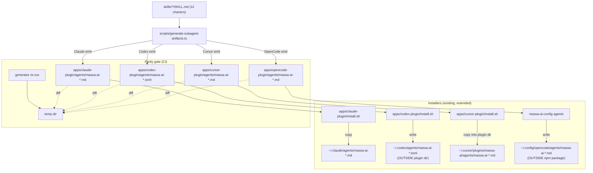

# Subagent Skills Plugin Parity Design

**Spec**: `.specs/features/subagent-skills-plugin-parity/spec.md`
**Status**: Draft

---

## Design Summary

Ship the 12 sub-agent specialists (defined in `skills/*/SKILL.md`) as host-native subagent definitions across all four plugins by introducing **one generator** that derives all shipped agent files from the charters, and **four installer extensions** (one per host) that copy/write those generated files into the host-native discovery locations. The generator is the single source of truth; a parity test asserts every shipped file is byte-identical to generator output, so charter→shipped drift fails CI. Per-host frontmatter adaptation (model pinning, effort pinning, permission boundaries, ownership markers) is encoded in the generator's per-host emitters, not hand-maintained per file. No new lifecycle hooks, no shared-binary change, no DB change. Existing `massa-ai-navigator.md` (Claude/Cursor) is preserved; the 12 specialists are additive.

---

## Requirements Traceability

| Requirement ID | Design component(s) |
| --- | --- |
| CLA-01,02 | `scripts/generate-subagent-artifacts.ts` Claude emitter → `apps/claude-plugin/agents/massa-ai-*.md`; `apps/claude-plugin/install.sh` copy loop |
| CLA-03 | Claude emitter permission mapping (read-only → `tools: ["Read","Grep","Glob","Bash"]`; write → + `Write`,`Edit`) |
| CLA-04 | Claude emitter omits `hooks`/`mcpServers`/`permissionMode` frontmatter |
| CLA-05 | `apps/claude-plugin/install.sh --uninstall` removes only `massa-ai-*.md` (name-prefix scoping) |
| CLA-06 | Idempotent copy (overwrite with identical content) |
| CLA-07 | `scripts/generate-subagent-artifacts.ts` + parity test (`__tests__/subagent-parity.test.ts`) |
| CLA-08 | Name-collision test against Claude built-ins (`Explore`,`Plan`,`general-purpose`) |
| CLA-09 | Exact-12-names test |
| CLA-10 | Claude emitter pins `model` (haiku/sonnet/opus) + `effort: high` |
| CDX-01..06 | Codex emitter → `apps/codex-plugin/agents/massa-ai-*.toml`; `apps/codex-plugin/install.sh` writes to `~/.codex/agents/` (OUTSIDE plugin dir); idempotent; uninstall by `# massa-ai-owned` marker |
| CDX-07 | Codex emitter escapes `"""` → `\"\"\"` in `developer_instructions`; TOML round-trip test; `# massa-ai-owned` top comment |
| CDX-08 | Parity test for Codex TOML |
| CDX-09 | Name-collision test against Codex built-ins (`default`,`worker`,`explorer`) |
| CDX-10 | Codex emitter pins `model` (gpt-5.4-mini/gpt-5.6-terra/gpt-5.6-sol) + `model_reasoning_effort = "high"` |
| CRS-01..05 | Cursor emitter → `apps/cursor-plugin/agents/massa-ai-*.md`; `apps/cursor-plugin/install.sh` copies into plugin `agents/`; navigator preserved; uninstall removes plugin dir (unchanged) |
| CRS-06 | Parity test for Cursor agents |
| CRS-07 | Name-collision + exact-12 test |
| CRS-08 | Cursor emitter pins `model` (charter hint verbatim) + `reasoningEffort: max` |
| OPC-01..06 | OpenCode emitter → `apps/opencode-plugin/agents/massa-ai-*.md`; new `install-agents` subcommand on `massa-ai-config` CLI writes to `~/.config/opencode/agents/` or `.opencode/agents/`; idempotent; uninstall by `metadata: { massa-ai-owned: true }` marker |
| OPC-07 | OpenCode emitter frontmatter `metadata: { massa-ai-owned: true }` + per-agent `permission` (bash deny/ask/allow per mapping) |
| OPC-08 | Parity test for OpenCode agents |
| OPC-09 | Name-collision test against OpenCode built-ins (`build`,`plan`,`general`,`explore`,`scout`) + exact-12 |
| OPC-10 | OpenCode emitter pins `model` (charter hint verbatim) + `reasoningEffort: max` |
| DOC-01 | Each per-plugin `install.sh` prints "+ 12 subagent specialists: ..." |
| DOC-02 | Root `README.md` `## Integration` / `### Plugin Bundles` summary + link to FEATURES.md |
| DOC-03 | `FEATURES.md` new "Subagent Skills (12 Specialists)" section (per-host depth) |
| DOC-04 | Root `install.sh` `install_plugins_menu` per-tool output mentions 12 specialists |
| DOC-05 | `scripts/install-agents.ts` Claude/OpenCode hint additions (extend existing pattern at `:306`,`:349`; add Codex/Cursor hints) |
| DOC-06 | FEATURES.md ↔ spec table parity test |
| DOC-07 | README → FEATURES.md relative link |

---

## Current Codebase Evidence

Inspected in this session (file:line pointers):

- `skills/*/SKILL.md` (12 charter files) — `metadata.model_hint` values: investigator/context-curator/documentation-agent/requirements-analyst = `DeepSeek V4 Pro`; planner/builder/reviewer/verification-agent/test-engineer/audit-specialist/mobile-specialist = `GLM-5.2`; architecture-specialist = `MiniMax M3`. `metadata.permission`: read-only (9 agents) vs write (builder, test-engineer, documentation-agent).
- `apps/claude-plugin/install.sh:181-212` — current install copies `commands/*.md` + `agents/massa-ai-navigator.md` + merges hooks into `settings.json`. **No subagent loop exists yet.** The agent copy is a single `cp` at `:192`.
- `apps/claude-plugin/agents/massa-ai-navigator.md:1-29` — frontmatter uses JSON-array `tools: ["mcp__massa-ai__*", "Read", "Grep", "Glob", "Bash(pwd)"]` (array form, the convention CLA emitters follow).
- `apps/claude-plugin/__tests__/install.test.ts:84-225` — existing installer tests; pattern to extend (spawnSync install.sh with temp HOME).
- `apps/codex-plugin/install.sh:170-213` — copies plugin bundle to `~/.codex/plugins/massa-ai/` + merges hooks into `~/.codex/hooks.json`. **No agent writing** (Codex agents live in `~/.codex/agents/`, separate).
- `apps/codex-plugin/.codex-plugin/plugin.json:1-8` — manifest has `skills`, `mcp`, `hooks`; **no `agents` field** (Codex doesn't bundle agents in plugins — confirmed via web research).
- `apps/codex-plugin/__tests__/manifest.test.ts:28-107` — existing manifest tests; pattern to extend.
- `apps/cursor-plugin/install.sh:179-225` — copies skills + agents (currently just navigator) into plugin dir + merges hooks. Agent copy loop at `:204`.
- `apps/cursor-plugin/__tests__/manifest.test.ts:76-82,121-140` — navigator existence test + directory-layout test; extend for 12 agents.
- `apps/opencode-plugin/package.json:1-47` — npm package `@massa-ai/opencode-plugin@1.1.0`, `bin.massa-ai-config: dist/config-cli.js`. **Agents are NOT npm-shipped** (`files: ["dist"]` only) — OpenCode discovers agents from the filesystem (`~/.config/opencode/agents/`).
- `apps/opencode-plugin/src/config-cli.ts:62-194` — CLI with `init`/`path`/`show`/`set`/`use` commands; **add `agents` subcommand** for install/uninstall.
- `apps/opencode-plugin/src/index.ts:118-770` — Plugin API (tools + in-process hooks). **No agent registration** — confirmed via OpenCode docs (agents are filesystem-discovered, not plugin-registered).
- `scripts/install-agents.ts:306,349` — existing Claude/OpenCode deconfliction hints; extend with subagent hint + add Codex/Cursor hints.
- Root `install.sh:665-735` — `install_plugins_menu()` with 5 options (Claude/Codex/Cursor/OpenCode/All). Per-tool install output to extend with "+ 12 subagent specialists".
- `README.md:149-184` — `### Plugin Bundles (4-Tool Parity)` summary table + `FEATURES.md` link pattern at `:184`.
- `FEATURES.md:190-294` — `## Plugins (4-Tool Parity)` depth section with per-plugin `### <name> plugin` subsections.

Active STATE.md Decisions checked: AD-007 (sandbox auto), AD-008 (json_schema), AD-009 (D5 Cypher removal). **None conflict** — this feature is additive (no DB, no binary, no LLM behavior). No project-level AD to supersede or add.

---

## Architecture Overview

### Approach exploration (Large/Complex)

**Approach A (recommended): One generator + four installer extensions.** A single `scripts/generate-subagent-artifacts.ts` reads `skills/*/SKILL.md` and emits all per-host agent files into `apps/{claude,codex,cursor,opencode}-plugin/agents/`. Outputs are checked into git. Each per-plugin `install.sh` (Claude/Codex/Cursor) and the OpenCode `massa-ai-config agents` subcommand copy/write those generated files into host-native discovery locations. A parity test regenerates into a temp dir and asserts byte-identity with the checked-in files. Drift = CI failure.

**Approach B: Hand-maintained per-host agent files (no generator).** Write the 48 agent files (12 × 4 hosts) by hand, maintain them manually. Simpler to ship initially, but drift between `skills/` charters and `apps/*/agents/` is silent — a charter update doesn't update shipped files. Plan-critic F1 flagged this as the most likely failure mode.

**Approach C: Generator runs at install time (not checked in).** The `install.sh` scripts run the generator on the fly. Avoids checked-in files but requires `bun` at install time (Codex/Cursor installers currently only need `bash` + `node`/`bun` for JSON; OpenCode needs the npm package). Slower install, more failure surface, harder offline use.

**Recommendation: Approach A.** Generator runs at dev/build time, outputs checked in. Plugins ship without a runtime build step (matches the existing script-copy bundle pattern). Drift is a deterministic CI check. Single source of truth. Reuses the existing `install.sh` copy loops (minimal change). The generator is ~150 LOC of straightforward frontmatter mapping.



---

## Code Reuse Analysis

### Existing Components to Leverage

| Component | Location | How to Use |
| --- | --- | --- |
| Charter `SKILL.md` files | `skills/*/SKILL.md` (12) | Generator reads frontmatter (`name`, `description`, `metadata.model_hint`, `metadata.permission`) + body (Mission/Responsibilities/Restrictions/Inputs/Outputs/Invocation/massa-ai Integration) as the single source |
| `massa-ai-navigator.md` | `apps/claude-plugin/agents/`, `apps/cursor-plugin/agents/` | Preserve as-is (Claude/Cursor). NOT generated — it's an index-first agent distinct from the 12 specialists. Codex/OpenCode do not receive it. |
| `install.sh` copy loops | `apps/claude-plugin/install.sh:184-192`, `apps/cursor-plugin/install.sh:188-204` | Extend the agents copy from single `cp` to a loop over `massa-ai-*.md` (Claude/Cursor) |
| `install.sh` hooks-merge node helper | `apps/codex-plugin/install.sh:68-150`, `apps/cursor-plugin/install.sh:71-159` | Reuse the `node`/`bun` runner pattern for the Codex agent-write step (TOML is text, but use node for idempotent file ops) |
| Ownership-marker convention | `scripts/install-agents.ts:41` (`OWNED_MARKER = "_massaAiOwned"`) | Codex uses `# massa-ai-owned` top comment; OpenCode uses `metadata: { massa-ai-owned: true }` frontmatter (hosts ignore unknown fields) |
| `massa-ai-config` CLI | `apps/opencode-plugin/src/config-cli.ts:62-194` | Add `agents` subcommand (`agents install [--user|--project]` / `agents uninstall`) — reuses the CLI entrypoint |
| Installer test pattern | `apps/claude-plugin/__tests__/install.test.ts` (spawnSync + temp HOME) | New `subagent-parity.test.ts` and per-host install tests follow this pattern |
| `install-agents.ts` hint pattern | `scripts/install-agents.ts:306,349` | Extend existing Claude/OpenCode hints + add Codex/Cursor subagent hints |
| `FEATURES.md` plugin section | `FEATURES.md:190-294` | Add "Subagent Skills (12 Specialists)" subsection under `## Plugins (4-Tool Parity)` |
| `README.md` plugin table | `README.md:156-161` | Extend bundles column to mention "+ 12 subagent specialists" + add link |

### Integration Points

| System | Integration Method |
| --- | --- |
| Claude Code agent discovery | Files at `~/.claude/agents/massa-ai-*.md` (user) or `.claude/agents/` (project); frontmatter `name`/`description`/`tools`/`model`/`effort` |
| Codex agent discovery | Files at `~/.codex/agents/massa-ai-*.toml` (user) or `.codex/agents/` (project); TOML `name`/`description`/`developer_instructions`/`model`/`model_reasoning_effort`/`sandbox_mode` |
| Cursor agent discovery | Files inside plugin dir `~/.cursor/plugins/massa-ai/agents/massa-ai-*.md` (auto-discovered); same frontmatter as Claude |
| OpenCode agent discovery | Files at `~/.config/opencode/agents/massa-ai-*.md` (user) or `.opencode/agents/` (project); frontmatter `description`/`mode: subagent`/`model`/`reasoningEffort`/`permission`/`metadata` |
| `install-agents.ts` | Extend hint print in `ClaudeCodeWriter.apply()` (`:306`), `OpenCodeWriter.apply()` (`:349`), and add `CodexWriter.apply()` + `CursorWriter.apply()` subagent hints |
| Root `install.sh` menu | `install_plugins_menu()` per-tool branches already invoke the installers; the installers' own output carries the "+ 12 subagent specialists" line |

---

## Components

### `scripts/generate-subagent-artifacts.ts` (NEW)

- **Purpose**: Single source of truth — reads `skills/*/SKILL.md`, emits per-host agent files into `apps/*/agents/`.
- **Location**: `scripts/generate-subagent-artifacts.ts`
- **Interfaces**:
  - `bun run scripts/generate-subagent-artifacts.ts` — emits all 48 files (12 × 4 hosts); idempotent (overwrites)
  - `bun run scripts/generate-subagent-artifacts.ts --check` — emit to temp dir, diff against checked-in files, exit non-zero on drift (used by parity test)
  - Internal: `parseCharter(file) → {name, description, modelHint, permission, body}`, `emitClaude(c)`, `emitCodex(c)`, `emitCursor(c)`, `emitOpenCode(c)`, `AGENT_MODELS_CLAUDE`, `AGENT_MODELS_CODEX`, `PERMISSION_TOOLS`
- **Dependencies**: `bun` (Bun file APIs), `skills/*/SKILL.md`
- **Reuses**: Charter frontmatter as input; the three model-pinning tables (encoded as `Record<agentName, model>` constants, matching the spec tables exactly — the parity test asserts these constants match the spec)

### Per-host frontmatter emitters (inside the generator)

- **Purpose**: Map charter fields → host-native frontmatter.
- **Location**: functions within `generate-subagent-artifacts.ts`
- **Claude emitter**: `name: massa-ai-<charter-name>`, `description: <charter description>`, `tools: [...]` (read-only → `["Read","Grep","Glob","Bash"]`; write → + `Write`,`Edit`), `model: <claude alias>` (haiku/sonnet/opus), `effort: high`. Omits `hooks`/`mcpServers`/`permissionMode`. Body = charter body (Mission…Memory Boundary) verbatim.
- **Codex emitter**: TOML file. Top comment `# massa-ai-owned`. `name = "massa-ai-<name>"`, `description = "..."`, `model = "<codex id>"`, `model_reasoning_effort = "high"`, `sandbox_mode = "read-only"` (read-only) or `"workspace-write"` (write), `developer_instructions = """<escaped body>"""`. Escape `"""` → `\"\"\"` in body.
- **Cursor emitter**: same frontmatter shape as Claude (array `tools`, `model` = charter hint verbatim, `reasoningEffort: max`). Body = charter body verbatim.
- **OpenCode emitter**: `description: <charter description>`, `mode: subagent`, `model: <charter hint verbatim>`, `reasoningEffort: max`, `permission: {edit: deny/allow, bash: deny/ask/allow}`, `metadata: {massa-ai-owned: true}`. Body = charter body verbatim.
- **Dependencies**: charter parsed fields
- **Reuses**: the spec's model-pinning + permission-mapping tables (encoded as constants)

### `apps/claude-plugin/install.sh` (EXTEND)

- **Purpose**: Copy the 12 generated `massa-ai-*.md` into `~/.claude/agents/` (or `.claude/agents/`) alongside the existing navigator copy + hooks merge.
- **Location**: `apps/claude-plugin/install.sh:191` (after navigator `cp`)
- **Interfaces**: add loop `for src in "$SCRIPT_DIR/agents/"massa-ai-*.md; do cp ...; done`; uninstall loop removes `~/.claude/agents/massa-ai-*.md` (name-prefix scoping, preserves navigator which is `massa-ai-navigator.md` — wait, that matches the prefix; **see Risks R1**)
- **Dependencies**: generated `apps/claude-plugin/agents/massa-ai-*.md`
- **Reuses**: existing install.sh structure

### `apps/codex-plugin/install.sh` (EXTEND)

- **Purpose**: Write the 12 generated TOML files into `~/.codex/agents/` (or `.codex/agents/`) — OUTSIDE the plugin dir.
- **Location**: `apps/codex-plugin/install.sh` (new block after plugin copy)
- **Interfaces**: `AGENTS_DIR="$CODEX_DIR/agents"`; loop `for src in "$SCRIPT_DIR/agents/"*.toml; do cp "$src" "$AGENTS_DIR/$(basename $src)"; done`; `--uninstall` removes only files with the `# massa-ai-owned` top comment (grep + rm)
- **Dependencies**: generated `apps/codex-plugin/agents/massa-ai-*.toml`
- **Reuses**: existing `CODEX_DIR` resolution

### `apps/cursor-plugin/install.sh` (EXTEND)

- **Purpose**: Copy the 12 generated `massa-ai-*.md` into the plugin's `agents/` dir (alongside navigator).
- **Location**: `apps/cursor-plugin/install.sh:204` (extend the agents copy)
- **Interfaces**: change single navigator `cp` to a loop over `agents/*.md` (includes navigator + 12 specialists)
- **Dependencies**: generated `apps/cursor-plugin/agents/massa-ai-*.md`
- **Reuses**: existing plugin-dir copy; uninstall already removes whole plugin dir

### `apps/opencode-plugin/src/config-cli.ts` (EXTEND) + `install-opencode-agents.sh` (NEW, optional)

- **Purpose**: New `agents` subcommand on `massa-ai-config` writes the 12 generated `.md` files to `~/.config/opencode/agents/` (or `.opencode/agents/`).
- **Location**: `apps/opencode-plugin/src/config-cli.ts` (add `case "agents"`); generated files at `apps/opencode-plugin/agents/massa-ai-*.md` (shipped in the npm package via `files` array update — **see Risks R2**)
- **Interfaces**: `massa-ai-config agents install [--user|--project]` / `massa-ai-config agents uninstall`; idempotent; uninstall removes only files with `metadata: { massa-ai-owned: true }`
- **Dependencies**: generated `apps/opencode-plugin/agents/massa-ai-*.md`
- **Reuses**: existing CLI structure; `getConfigDir()` for scope resolution

### Parity test `scripts/__tests__/subagent-parity.test.ts` (NEW)

- **Purpose**: Assert no drift between generator output and checked-in files; assert model/effort/permission pinning; assert name-collision-free; assert exact 12 names; assert FEATURES.md table parity.
- **Location**: `scripts/__tests__/subagent-parity.test.ts` (or per-app `__tests__/`)
- **Interfaces**: `bun test` — runs generator with `--check`, parses emitted frontmatter per host, asserts against spec tables, asserts FEATURES.md tables byte-match spec
- **Dependencies**: generator, checked-in agent files, `FEATURES.md`, spec tables (encoded as test fixtures)
- **Reuses**: `bun:test`

### Per-host install tests (EXTEND existing)

- **Purpose**: Assert the installers write the 12 agents to the right place with right frontmatter.
- **Location**: extend `apps/claude-plugin/__tests__/install.test.ts`, `apps/codex-plugin/__tests__/install.test.ts`, `apps/cursor-plugin/__tests__/manifest.test.ts`; new `apps/opencode-plugin/src/__tests__/agents-install.test.ts`
- **Interfaces**: spawnSync install with temp HOME, assert 12 files exist with correct `model`/`effort`/`tools`/`sandbox_mode`/`permission` per host
- **Reuses**: existing spawnSync + temp HOME pattern

---

## Data Models

No new database models. The generated agent files use host-native schemas (already documented in spec). Generator internal types:

```typescript
interface Charter {
  name: string;              // e.g. "investigator"
  description: string;
  modelHint: string;         // e.g. "DeepSeek V4 Pro" (verbatim from metadata.model_hint)
  permission: "read-only" | "write";
  body: string;              // markdown body (Mission...Memory Boundary)
}

const AGENT_MODELS_CLAUDE: Record<string, "haiku"|"sonnet"|"opus"> = { /* spec Claude table */ };
const AGENT_MODELS_CODEX: Record<string, string> = { /* spec Codex table */ };
// Cursor + OpenCode use charter.modelHint verbatim

const READ_ONLY_TOOLS = ["Read", "Grep", "Glob", "Bash"];
const WRITE_TOOLS = [...READ_ONLY_TOOLS, "Write", "Edit"];
```

---

## Error Handling Strategy

| Error Scenario | Handling | User Impact |
| --- | --- | --- |
| Generator run with missing `skills/*/SKILL.md` | Exit non-zero with list of missing charters | CI fails; developer fixes charters |
| Charter frontmatter missing `metadata.model_hint` (Cursor/OpenCode target) | Generator exits non-zero (required for those hosts) | CI fails; charter fixed |
| Generator `--check` detects drift | Exit non-zero, print diff | CI fails; developer re-runs generator |
| Codex TOML body contains `"""` | Generator escapes to `\"\"\"`; TOML round-trip test verifies | No broken TOML |
| `install.sh` agents dir doesn't exist | `mkdir -p` (idempotent) | None |
| User has unmarked `massa-ai-<name>.md` (Claude) | Overwrite (name-prefix scoping) — **see Risks R1** | Pre-existing file replaced (acceptable; prefix is massa-ai-owned namespace) |
| User has unmarked agent in `~/.codex/agents/` | Installer only writes `massa-ai-*.toml`; user files preserved | None |
| `massa-ai-config agents uninstall` finds no owned files | No-op, print message | None |
| Pinned model unavailable on host | Host falls back (Claude→inherit, OpenCode→primary agent model); Cursor/Codex resolve by name/ID | Agent loads on fallback model — acceptable graceful degrade |

---

## Risks & Concerns

| Concern | Location (file:line) | Impact | Mitigation |
| --- | --- | --- | --- |
| R1: Claude uninstall `massa-ai-*.md` glob also matches `massa-ai-navigator.md` | `apps/claude-plugin/install.sh` (proposed uninstall loop) | Navigator would be removed on `--uninstall`, contradicting CLA-05 ("preserving navigator") | Uninstall loop excludes `massa-ai-navigator.md` explicitly (`for f in massa-ai-*.md; do [[ "$f" == *navigator* ]] && continue; rm ...; done`) OR the 12 specialists use a distinct prefix like `massa-ai-agent-*.md`. **Design choice: exclude navigator by name in the uninstall loop** (keeps the `massa-ai-` namespace consistent with Codex/OpenCode). Test asserts navigator survives uninstall. |
| R2: OpenCode agents shipped in npm package | `apps/opencode-plugin/package.json:10` (`files: ["dist"]`) | The generated `.md` agent files aren't in `dist`, so `npm install` won't include them → `massa-ai-config agents install` can't find them at runtime | Two options: (a) add `agents/*.md` to `files` array so they ship in the npm tarball, and `massa-ai-config agents install` reads from the package dir; (b) ship a separate `@massa-ai/opencode-agents` package. **Design choice: (a)** — add `agents/` to `files`, generator output ships in the package, CLI reads from `__dirname/../agents/` (resolved at build time). |
| R3: Codex/OpenCode agent dirs are shared with user agents | `~/.codex/agents/`, `~/.config/opencode/agents/` | Uninstall must not remove user agents | In-file ownership markers (`# massa-ai-owned` / `metadata: { massa-ai-owned: true }`); uninstall greps for the marker. Test pre-seeds a user agent + runs uninstall + asserts user agent survives. |
| R4: Generator drift between charter and shipped files | `skills/*/SKILL.md` vs `apps/*/agents/` | Silent divergence (F1) | `--check` mode + parity test in CI; generator is the only write path |
| R5: TOML `developer_instructions` escaping | Codex emitter | Broken TOML parse → Codex won't load agent | Escape `"""` → `\"\"\"`; TOML round-trip parse test on every generated file |
| R6: Cursor `reasoningEffort` field name unverified | Cursor subagent docs returned 404 | Field may be silently ignored (harmless) or rejected | Pass-through convention (matches OpenCode); if Cursor ignores unknown frontmatter it's a no-op. Document as accepted assumption. Verification deferred — if a future Cursor doc confirms the field name, update the emitter. |
| R7: OpenCode `reasoningEffort: max` provider-honoring | DeepSeek/GLM/MiniMax | Provider may ignore `max` | Pin emitted verbatim; honoring is host/provider behavior. Accepted assumption. |
| R8: Name collision with host built-ins | All hosts | Shadowing a built-in could break expected behavior | None of the 12 names collide (verified: Codex `default/worker/explorer`, Claude `Explore/Plan/general-purpose`, OpenCode `build/plan/general/explore/scout`). Name-collision test asserts it. |
| R9: Existing test `apps/cursor-plugin/__tests__/manifest.test.ts:76` asserts navigator exists | `:76-82` | Adding 12 agents requires the directory-layout test (`:121-140`) to still pass | Extend, don't replace — the 12 specialists are additive to the `agents/` dir. |
| R10: `massa-ai-navigator.md` uses `mcp__massa-ai__*` in tools — the 12 specialists don't | `apps/claude-plugin/agents/massa-ai-navigator.md:4` | Inconsistent tools surface between navigator and specialists | Acceptable: navigator is index-first (needs MCP tools); specialists are general-purpose (Read/Grep/Glob/Bash/Write/Edit). Different roles, different tools. |

---

## Verification Design

### How tests prove each high-risk requirement

| Requirement | Verification |
| --- | --- |
| CLA-07/CDX-08/CRS-06/OPC-08 (drift parity) | `subagent-parity.test.ts`: run `generate-subagent-artifacts.ts --check`, assert exit 0 + no diff |
| CLA-10 (Claude model+effort pin) | Parity test parses each `apps/claude-plugin/agents/massa-ai-*.md` frontmatter, asserts `model` matches `AGENT_MODELS_CLAUDE[name]` and `effort: high` |
| CDX-10 (Codex model+effort pin) | Parity test parses each `.toml`, asserts `model` + `model_reasoning_effort = "high"` |
| CRS-08/OPC-10 (model+effort pin) | Parity test asserts `model` == charter hint verbatim + `reasoningEffort: max` |
| CLA-03/CDX-03 (permission boundaries) | Parity test asserts read-only agents lack `Write`/`Edit` (Claude) / have `sandbox_mode = "read-only"` (Codex) |
| CLA-08/CDX-09/OPC-09 (name collision) | Parity test asserts no shipped name ∈ host built-in set |
| CLA-09/CRS-07/OPC-09 (exact 12) | Parity test asserts the 12 emitted names == the registry 12 |
| CDX-07 (TOML round-trip + owned marker) | Parity test parses each `.toml` (TOML parser), asserts no parse error + first line is `# massa-ai-owned` |
| CLA-05 (uninstall preserves navigator) | Install test: run `--uninstall`, assert `massa-ai-navigator.md` survives, 12 specialists gone |
| R3 (uninstall preserves user agents) | Codex/OpenCode install test: pre-seed a user agent file (no marker), run uninstall, assert user agent survives |
| DOC-06 (FEATURES ↔ spec parity) | Parity test extracts the 4 tables from `FEATURES.md`, asserts byte-match with spec tables (encoded as fixtures) |
| Installer writes 12 to right place | Per-host install tests (spawnSync + temp HOME): assert 12 files at the host discovery path with correct frontmatter |

### Gate check commands

- `bun run scripts/generate-subagent-artifacts.ts --check` — drift gate
- `bun test scripts/__tests__/subagent-parity.test.ts` — parity + pinning + collision + FEATURES parity
- `bun test apps/claude-plugin/__tests__/` — Claude install (extended)
- `bun test apps/codex-plugin/__tests__/` — Codex install (extended)
- `bun test apps/cursor-plugin/__tests__/` — Cursor manifest (extended)
- `bun test apps/opencode-plugin/src/__tests__/agents-install.test.ts` — OpenCode agents install (new)
- `bun run type-check` — 6/6 (generator is TS; CLI extension is TS)
- `bun run build` — 5/5 (opencode-plugin build must include the new `agents/` dir — R2)

---

## Tech Decisions

| Decision | Choice | Rationale |
| --- | --- | --- |
| Generator approach | One TS generator, outputs checked in | F1 drift mitigation; single source of truth; no runtime build step |
| Codex agent location | `~/.codex/agents/` (OUTSIDE plugin dir) | Codex plugin.json has no `agents` field; custom agents load from the config-root `agents/` dir (web-confirmed) |
| OpenCode agent location | `~/.config/opencode/agents/` (OUTSIDE npm package) | OpenCode discovers agents from filesystem, not the Plugin API (web-confirmed); npm package ships the generated files via `files` array (R2) |
| Claude uninstall scoping | Exclude `massa-ai-navigator.md` by name in the loop | R1: the `massa-ai-*.md` glob would catch navigator; explicit exclusion preserves it per CLA-05 |
| Codex/OpenCode ownership marker | In-file (`# massa-ai-owned` / `metadata`) | R3: shared agent dirs need a per-file marker for scoped uninstall |
| Cursor `reasoningEffort` field | Emit `reasoningEffort: max` (pass-through) | R6: unverified but harmless if ignored; matches OpenCode convention |
| Model hint for Cursor/OpenCode | Charter `metadata.model_hint` verbatim | User directive: "use the models already defined in the agents skills markdown files" |
| Generator output location | `apps/<plugin>/agents/` (checked in) | Co-located with each plugin; installers copy from there; parity test diffs there |

> **Project-level decisions:** None. All decisions here are feature-local. No `AD-NNN` entry needed — the feature is additive (no DB, no binary, no LLM behavior, no cross-service contract). Active AD-007/008/009 unaffected.

---

## Artifact-Store Evidence

- Active artifact key: `.specs/features/subagent-skills-plugin-parity/design.md`
- Version: 1 (initial Design)
- Checksum: `a7fa79c8fd3e47089af5fb891aaa2e37b49db6febd9784383c227ee0e167461f`
- Chosen approach: A (one generator + four installer extensions), user-confirmed via spec confirmation + this design's recommendation. Approaches B (hand-maintained) and C (runtime generation) rejected — B has silent drift (F1), C adds runtime build dependency.