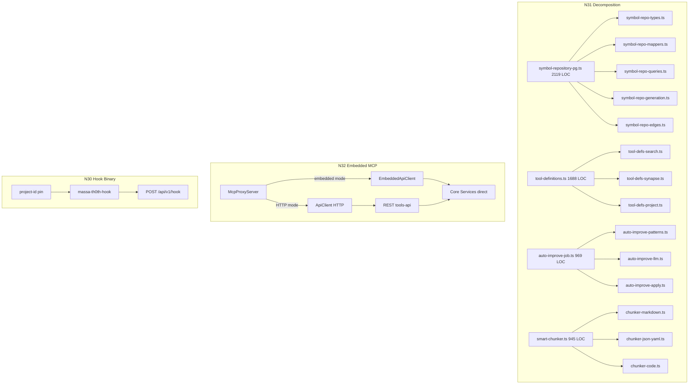

# Wave 6 — Architecture & Medium Features Design

**Spec**: `.specs/features/wave-6-architecture-features/spec.md`
**Status**: Draft

---

## Architecture Overview

Wave 6 reduces structural debt across four themes: module decomposition (N31), process consolidation (N32), operational hardening (N30/N20/N21), and observability/process (N28/N29/N17/N18) plus carryovers (N19/N42/M25/M26/M62).



---

## Large/Complex Approach Tradeoffs

### N31 God-File Decomposition — Approach A: Delegate modules (Recommended)

**Recommendation: A — M14-proven delegate pattern.**

| Approach | Description | Tradeoff |
| --- | --- | --- |
| **A. Delegate modules** (M14 precedent) | Class stays as facade; method bodies move to module functions receiving `this` as param; barrel re-exports unchanged | Pro: byte-identical facade, proven on this repo (M14 PASS), characterization tests pin behavior. Con: `private`→`public` relaxation on moved fields (compile-time-only, runtime identical) |
| B. Full class split | Break classes into multiple smaller classes with composition | Pro: cleaner OOP. Con: changes constructor signatures, breaks singleton getInstance(), higher risk, M14 rejected this |
| C. Extract functions only | Move free functions out, keep class methods | Pro: minimal. Con: doesn't help when the class itself is the god-file (symbol-repository-pg, auto-improve-job) |

**User confirmation needed**: Approach A confirmed by M14 precedent on this repo (`c92e481`, validated PASS).

### N32 Embedded MCP — Approach A: ToolProxyApiClient swap (Recommended)

**Recommendation: A — swap the client behind the existing interface.**

| Approach | Description | Tradeoff |
| --- | --- | --- |
| **A. ToolProxyApiClient swap** | `ToolProxyApiClient` interface at `call-tool-proxy.ts:6` already abstracts get/post/patch/delete. Add `EmbeddedApiClient` implementing it via direct core-service calls. MCP server picks based on `MASSA_TH0TH_EMBEDDED` env | Pro: minimal change, interface exists, parity testable. Con: `index` tool special-case needs in-process handler |
| B. In-process Elysia | Start tools-api routes in-process without HTTP | Pro: route parity. Con: Elysia overhead, still serializes through HTTP-like middleware, not truly embedded |
| C. Dual-mode server | MCP server includes REST server as library | Pro: one process. Con: changes tools-api packaging, coupling increases |

### N20 Parallel Test Runner — Approach A: Macro table + child processes (Recommended)

**Recommendation: A — macro table drives both listing and execution.**

| Approach | Description | Tradeoff |
| --- | --- | --- |
| **A. Macro table + child processes** | Single `SUITE_TABLE` array; `--list-suites` prints it; runner spawns child processes per suite in parallel; UNION GUARD compares results to list | Pro: single source of truth (list = execute), parallel via child processes (isolation), ZERO-LOSS guard. Con: new script to maintain |
| B. Bun test built-in parallel | Use Bun's `--concurrency` | Pro: no new script. Con: Bun test concurrency is within-process (shared state), not suite-level isolation; doesn't solve live-DB suite isolation |
| C. Vitest sharding | Switch to vitest with sharding | Pro: built-in sharding. Con: massive migration from Bun test, changes test runner, high risk |

---

## Code Reuse Analysis

### Existing Components to Leverage

| Component | Location | How to Use |
| --- | --- | --- |
| M14 delegate pattern | `.specs/features/god-files-refactor/design.md` | Apply same pattern: characterization test first, thin-delegate class, module functions, barrel re-exports |
| `ToolProxyApiClient` interface | `apps/mcp-client/src/call-tool-proxy.ts:6` | N32: implement `EmbeddedApiClient` against this interface; no proxy change needed |
| `proxyCallTool` | `apps/mcp-client/src/call-tool-proxy.ts:53` | N32: unchanged — receives any `ToolProxyApiClient` |
| `AttributionResolver` | `packages/core/src/services/hooks/attribution-resolver.ts` | N30: hook binary reuses same resolution logic |
| `scheduler.status()` | `packages/core/src/services/scheduler/scheduler.ts:479` | N28: expose via new route, dashboard reads it |
| `WriterQueue.pendingCount` | `packages/core/src/services/hooks/writer-queue.ts:27` | N28: dashboard reads hook lag |
| `/api/v1/synapse/sessions` | `apps/tools-api/src/routes/synapse.ts:14` | N28: dashboard reads Synapse count |
| `run-tests-isolated.ts` classifier | `packages/core/scripts/run-tests-isolated.ts:88` | N20: suite classification logic feeds the macro table |
| `observation-extractor.ts` | `packages/core/src/services/hooks/observation-extractor.ts` | N21: test-seam feeds real responses to this parser |
| `sanitizeFilePath` | `packages/shared/src/utils/sanitizer.ts` | N30: hook binary path safety |

### Integration Points

| System | Integration Method |
| --- | --- |
| Core services (search, memory, project) | N32: `EmbeddedApiClient` calls controllers directly (SearchController, MemoryController, etc.) |
| Scheduler | N28: new `GET /api/v1/scheduler/status` route wrapping `scheduler.status()` |
| Hook queue | N28: new `GET /api/v1/hooks/queue-status` route wrapping `WriterQueue.pendingCount` |
| Web UI | N28: add `#/dashboard` hash route + `dashboard.js` section in `app.js` |
| Scheduler config | N29: add preset logic in `scheduler-defaults.ts` before per-job env reads |

---

## Components

### N31: SymbolRepositoryPg Decomposition

- **Purpose**: Split 2119-LOC god-file into ≤600 LOC modules
- **Location**: `packages/core/src/data/symbol/`
- **Modules**:
  - `symbol-repo-types.ts` (~220 LOC) — all interfaces/types (L19-219)
  - `symbol-repo-identity.ts` (~120 LOC) — SQL identity helpers: TransactionClient, definitionIdentityColumns, generationDefinitionIdentityColumns, referenceSourceSpan (L221-310 — NOT mappers, used by queries)
  - `symbol-repo-mappers.ts` (~140 LOC) — mapDef/mapRef/mapImp/mapWs + Raw interfaces (L312-610)
  - `symbol-repo-queries.ts` (~450 LOC) — workspace/file/definition/reference/import CRUD methods
  - `symbol-repo-generation.ts` (~350 LOC) — generation-scoped writes (copyFileGeneration, writeFileGeneration, etc.)
  - `symbol-repo-graph.ts` (~350 LOC) — getProjectMapSnapshot, getProjectMapAggregates, findEdges, runBfsCteImpact, countEdgesByKind
- **Facade**: `symbol-repository-pg.ts` (~120 LOC) — singleton, constructor, 1-line delegates, barrel re-export
- **Characterization test**: `symbol-repository-pg.characterization.test.ts` — pins key query results before split
- **Reuses**: M14 delegate pattern verbatim
- **CRITICAL — line drift**: design doc ranges are approximate. Re-verify against actual file at each task. Never extract blind from design doc numbers.

### N31: ToolDefinitions Decomposition

- **Purpose**: Split 1688-LOC tool definition array into domain modules
- **Location**: `apps/mcp-client/src/tool-defs/`
- **Modules** (by tool-name prefix, each ≤600 LOC):
  - `tool-defs-search.ts` — search, search_definitions, get_references, go_to_definition, trace_path, impact_analysis, symbol_snippet
  - `tool-defs-memory.ts` — remember, recall, memory_update, memory_delete, memory_list, list_checkpoints, create_checkpoint, restore_checkpoint, compress, optimized_context, analytics
  - `tool-defs-synapse.ts` — 9 synapse_* tools + synapse_task_begin/end
  - `tool-defs-project.ts` — index, index_status, list_projects, project_map, get_architecture, reset_project, reindex, rename_project, merge_projects, bootstrap
  - `tool-defs-hooks-exec.ts` — hook_ingest, compact_snapshot, handoff_*, list_proposals, approve_proposal, reject_proposal, execute, execute_file, batch_execute, fetch_and_index
- **Facade**: `tool-definitions.ts` (~40 LOC) — imports all, concatenates into `TOOL_DEFINITIONS`, re-exports `getToolDefinition`
- **Characterization test**: `tool-definitions.characterization.test.ts` — pins exact roster (52 tools, order, schemas)

### N31: AutoImproveJob Decomposition

- **Purpose**: Split 969-LOC job file into domain modules
- **Location**: `packages/core/src/services/jobs/`
- **Modules**:
  - `auto-improve-patterns.ts` (~200 LOC) — detectPatterns, extractQuery, extractFilePath, extractFixSignature, pathBucket, STOPWORDS, normalizeSignature
  - `auto-improve-llm.ts` (~120 LOC) — enrichWithLlm, buildEnrichmentPrompt, ProposalEnrichmentSchema
  - `auto-improve-apply.ts` (~200 LOC) — applyProposal, readTargetForApply, validateCreatePayload, buildUpdatePatch, ApplyRejection
  - `auto-improve-config.ts` (~80 LOC) — DEFAULT_THRESHOLDS, FALLBACK_AUTO_IMPROVE, readAutoImproveConfig, VALID_MEMORY_TYPES
- **Facade**: `auto-improve-job.ts` (~250 LOC) — class with 1-line delegates, getAutoImproveJob/resetAutoImproveJob
- **Characterization test**: `auto-improve-job.characterization.test.ts` — pins detectPatterns output + approve/reject state transitions

### N31: SmartChunker Decomposition

- **Purpose**: Split 945-LOC chunker into format modules
- **Location**: `packages/core/src/services/search/chunker/`
- **Pattern**: **Extract-functions (Approach C), NOT delegate-class (Approach A)** — smart-chunker.ts has NO class, only free functions. Moving free functions to modules is mechanically simpler (no `this` to pass). Barrel uses `export *` or explicit re-exports.
- **Modules**:
  - `chunker-types.ts` (~60 LOC) — Chunk, ChunkerConfig, DEFAULT_CONFIG interfaces
  - `chunker-markdown.ts` (~120 LOC) — chunkMarkdown, chunkMarkdownByHeadings
  - `chunker-json-yaml.ts` (~200 LOC) — chunkJSON, chunkYAML
  - `chunker-code.ts` (~300 LOC) — chunkCode, findCodeBoundaries, CodeBoundary, RESERVED_KEYWORDS, regex consts, netBraceDelta, extractFileImports, CODE_EXTENSIONS, isCodeFile
  - `chunker-post.ts` (~200 LOC) — postProcess, splitOversizedChunk, splitLineByChars, chunkFixed
- **Facade**: `smart-chunker.ts` (~80 LOC) — smartChunk dispatcher + re-exports
- **Characterization test**: `smart-chunker.characterization.test.ts` — pins byte-identical Chunk[] output per format. **Reconcile with existing `smart-chunker.test.ts`** (extend or supersede with documented note).

### N32: EmbeddedApiClient

- **Purpose**: In-process tool dispatch without HTTP
- **Location**: `apps/mcp-client/src/embedded-api-client.ts`
- **Interface**: implements `ToolProxyApiClient` (get/post/patch/delete) PLUS `uploadAndIndex` + `healthCheck` (not on the proxy interface — `McpProxyServer` calls these directly on `apiClient: ApiClient`)
- **Implementation**: maps endpoints to core service/controller calls directly (SearchController.search, MemoryController.list, etc.)
- **CRITICAL**: `handleIndexTool` in embedded mode must exercise same path-safety validation as HTTP route (`project.ts:351-356` traversal guard). `EmbeddedApiClient.uploadAndIndex` does in-process file indexing (not HTTP multipart) with path safety.
- **Dependencies**: core package services (imported, not HTTP-called)
- **Reuses**: `ToolProxyApiClient` interface, `proxyCallTool` unchanged for non-index tools
- **Parity test**: same tool call in both modes → same result shape — **including `index` tool**, not just proxy tools

### N30: massa-th0th-hook Binary

- **Purpose**: Single typed Bun binary replacing 7 shell scripts
- **Location**: `apps/claude-plugin/hooks/massa-th0th-hook.ts` (source) → compiled binary
- **Interface**: `massa-th0th-hook <event-type>` reads JSON from stdin, POSTs to `/api/v1/hook`
- **Subcommands**: `session-start`, `user-prompt-submit`, `post-tool-use`, `pre-compact` (SPECIAL: 2 POSTs), `stop`
- **CRITICAL — `pre-compact` special case**: does TWO POSTs: (1) observation to `/api/v1/hook` (3s timeout, observation body `{event, projectId, sessionId, cwd, payload}`), (2) snapshot to `/api/v1/hook/compact-snapshot` (5s timeout, snapshot body `{sessionId, projectId, persist, cwd}`). All other subcommands are uniform single-POST to `/api/v1/hook` (2s timeout).
- **Dependencies**: `AttributionResolver` logic, `fetch()` (Bun-native, no curl/jq), core types
- **Reuses**: `_pin.sh` resolution logic (port to TS), `_post.sh` POST semantics (2s timeout, exit 0), `pre-compact.sh` dual-POST logic

### N20: Parallel Test Runner

- **Purpose**: Parallel suite execution with ZERO-LOSS guard
- **Location**: `scripts/run-tests-parallel.ts`
- **Interface**: `run-tests-parallel [--list-suites] [--filter <regex>] [--serial-tail <suites>]`
- **Macro table**: `SUITE_TABLE: SuiteDef[]` — each has `id, description, testFiles[], isolationReason, deadlineSensitive`
- **Execution**: spawn child processes per non-deadline-sensitive suite concurrently; serial tail for deadline-sensitive
- **UNION GUARD**: after all complete, compare result-set to `SUITE_TABLE` list; fail if any missing
- **Reuses**: `run-tests-isolated.ts` classifier logic (L88-127) to populate the macro table

### N21: Test-Seam Fixtures

- **Purpose**: Real tool-response fixtures feeding consumer parsers
- **Location**: `packages/core/src/__tests__/test-seam/`
- **Fixtures**: `fixtures/search-response.json`, `fixtures/read-file-response.json`, `fixtures/impact-analysis-response.json` (frozen, deterministic)
- **Tests**: `observation-extractor.test.ts` enhanced to consume fixtures; `synapse-consumer.test.ts` new
- **Reuses**: existing `observation-extractor.ts` (unchanged), existing test structure

### N28: Dashboard

- **Purpose**: `/dashboard` observability route
- **Location**: `apps/web-ui/src/static/dashboard.js` + `apps/tools-api/src/routes/dashboard.ts`
- **New routes**: `GET /api/v1/scheduler/status`, `GET /api/v1/hooks/queue-status`
- **UI**: `#/dashboard` hash route in `index.html`, dashboard section in `app.js`
- **Reuses**: scheduler `status()`, `WriterQueue.pendingCount`, `/api/v1/synapse/sessions`, `/api/v1/system/metrics`

### N29: Scheduler Safe-Defaults Preset

- **Purpose**: One env var enables safe maintenance
- **Location**: `packages/core/src/services/scheduler/scheduler-defaults.ts`
- **Logic**: when `MASSA_TH0TH_SCHEDULER_SAFE_DEFAULTS=true`, set consolidation+decay `defaultEnabled=true` at conservative intervals; auto-improve stays false; individual envs override preset; master switch still required
- **CRITICAL — wiring**: `applySafeDefaults` MUST be called INSIDE `registerDefaultJobs` before the `envBool` loop at L157 reads `defaultEnabled`. NOT a separate export (silent no-op if caller forgets).

### N17/N18: Protocol + Deterministic Script

- **Purpose**: Contribution protocol template + deterministic-only test mode
- **Location**: `CONTRIBUTING.md` (N17), `scripts/run-deterministic.ts` (N18)
- **N17**: 7-step protocol (contract → register → preserve argv → read-only export → deliver-before-ack → invariants → tests)
- **N18**: `_DETERMINISTIC_ONLY=1` skips DB/network/grammar suites; runs pure-unit only

### N19/N42/M25/M26/M62: Carryovers

- **N19**: `apps/tools-api/src/middleware/admin-preservation.ts` — four-rung ladder check
- **N42**: `docs/path-recovery.md` + `--recover` flag in project CLI
- **M25**: project resolution by name tail in `ProjectService`
- **M26**: composite/escaped JSON extraction in `serializeToolResponse`
- **M62**: `scripts/verify-glr-stack-depth.ts` — read-only probe

---

## Data Models

No new database migrations required except:

### N28: Scheduler status route (read-only, no migration)

```typescript
interface SchedulerStatusResponse {
  running: boolean;
  tickIntervalMs: number;
  jobs: Array<{
    id: string;
    name: string;
    jobKind: string;
    enabled: boolean;
    nextRunAt: number | null;
    lastRunAt: number | null;
    lastSuccessAt: number | null;
    consecutiveFailures: number;
    due: boolean;
    currentlyRunning: boolean;
  }>;
}
```

### N28: Hook queue status (read-only)

```typescript
interface HookQueueStatus {
  pendingCount: number;
  maxPending: number;
  saturated: boolean;
}
```

### N29: Preset config (runtime only, no persistence)

```typescript
// In scheduler-defaults.ts
function applySafeDefaults(job: DefaultScheduledJob): DefaultScheduledJob {
  if (envBool("MASSA_TH0TH_SCHEDULER_SAFE_DEFAULTS", false)) {
    if (job.jobKind === "memory-consolidation" || job.jobKind === "decay-sweep") {
      return { ...job, defaultEnabled: true };
    }
  }
  return job;
}
```

---

## Error Handling Strategy

| Error Scenario | Handling | User Impact |
| --- | --- | --- |
| Decomposed module import breaks | Barrel re-export maintains path; type-check catches | Compile error, no runtime break |
| Embedded mode tool not found | Same `ToolError` shape as HTTP mode | Error message identical |
| Hook binary receives malformed JSON | Exit 0, no POST (same as shell jq failure) | Silent, fire-and-forget |
| Parallel runner suite crashes | Counted as failed, not dropped; UNION GUARD catches | CI failure, not silent skip |
| Dashboard endpoint unavailable | UI shows "unavailable" | No crash |
| Preset + master switch off | No jobs run | Expected (preset doesn't bypass master) |
| `--recover` with bad projectId | Error with not-found | Clear message |

---

## Risks & Concerns

| Concern | Location (file:line) | Impact | Mitigation |
| --- | --- | --- | --- |
| N31 line drift mid-refactor | All 4 target files | Wrong extraction ranges | Re-confirm ranges at each task; never edit blind from design doc numbers |
| N32 embedded mode misses HTTP-specific behavior | `api-client.ts:103` (fetch headers, retry) | Tool errors differ | Characterization test: run same tool in both modes, assert identical error shape |
| N30 hook binary changes timing | `_post.sh:77` (2s timeout) | Hook deadline breach | Binary uses same 2s AbortSignal timeout; characterization test measures exit time |
| N20 parallel runner masks suite failures | new script | Silent coverage loss | UNION GUARD is the primary defense; test it with a deliberately-crashing suite |
| N21 fixtures go stale | `test-seam/fixtures/` | False confidence | Fixtures are frozen snapshots; test-seam detects drift vs current responses (drift = test fails = update fixture intentionally) |
| N28 scheduler route exposes internals | new route | Info leak | Route is read-only, same API-key gate as other routes; no sensitive data in status |
| N29 preset enables too aggressively | `scheduler-defaults.ts` | Unexpected consolidation | Preset only enables consolidation+decay (safe, non-destructive); auto-improve stays opt-in; master switch still required |
| N19 admin preservation logic premature | auth not implemented | Dead code | N19 is conditional per plan; implement minimal preservation logic, document as "ready when auth grows" |
| M62 GLR probe inconclusive | tree-sitter binding internals | Can't verify | Document findings; if cap unknown, report "cap not exposed by binding API" |

---

## Tech Decisions

| Decision | Choice | Rationale |
| --- | --- | --- |
| N31 split pattern | Delegate modules (M14 precedent) | Proven on this repo, byte-identical facade, characterization tests |
| N32 embedded seam | `ToolProxyApiClient` interface swap | Interface exists, minimal change, parity testable |
| N30 binary framework | Bun (matches repo runtime) | Native fetch, TS types, same build system |
| N20 parallelism | Child processes (not threads) | Suite isolation (live-DB suites need process isolation) |
| N21 fixture format | Frozen JSON files | Deterministic, diff-able, no runtime capture needed |
| N28 dashboard data source | Existing routes + 2 new read-only routes | No new persistence; reads existing state |
| N29 preset scope | Consolidation + decay only | Safe, non-destructive jobs; auto-improve stays opt-in |

> **Project-level decisions:** No new AD-NNN entries needed — all decisions conform to existing AD-001 through AD-006 (native runtime, parser pool, FQN codec unchanged). Wave 6 touches application layer, not native/structural contracts.

---

## Verification Design

| High-Risk Requirement | Verification |
| --- | --- |
| N31 byte-identical facade | Characterization tests pass before+after every split commit; barrel re-export type-checks |
| N32 embedded = HTTP parity | Run same tool call in both modes, assert identical response shape (including errors) |
| N30 hook binary = shell semantics | Characterization test: same stdin → same POST body → same exit code (0) |
| N20 ZERO-LOSS guard | Deliberately crash a suite → UNION GUARD fails → confirms guard works |
| N21 drift detection | Mutate a fixture response shape → consumer test fails → confirms detection |
| N28 dashboard renders | Start server → curl `/dashboard` → verify scheduler/queue/synapse sections present |
| N29 preset safety | Set preset without master switch → no jobs run; set preset + master → only consolidation+decay run |

---

## Reuse Plan

- M14 design.md is the template for all 4 N31 decompositions (characterization → delegate → barrel)
- `ToolProxyApiClient` interface eliminates N32 proxy changes
- `scheduler.status()` already returns the data N28 needs
- `run-tests-isolated.ts` classifier feeds N20 macro table
- `observation-extractor.ts` is the N21 test target (unchanged)
- Shell hook scripts' logic is ported verbatim to N30 binary (same resolution order, same timeouts)

## Rejected Alternatives

- N31 full class split (changes singleton, breaks getInstance)
- N32 in-process Elysia (HTTP-like overhead, not truly embedded)
- N20 Bun built-in concurrency (no suite-level isolation, doesn't solve live-DB problem)
- N20 vitest migration (massive change, high risk, out of scope)
- N28 new persistence layer (reads existing state, no migration needed)