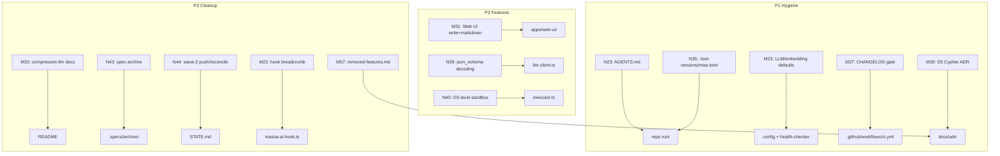

# Wave 7 — Hygiene, UI, Process, Decisions Design

**Spec**: `.specs/features/wave-7-hygiene-ui-process/spec.md`
**Status**: Draft

---

## Architecture Overview

Wave 7 is a batch of 13 independent items spanning config hygiene, web UI, executor security, LLM client, docs, CI, and process. No single architecture — each item is a surgical change to an existing component. The design defines each item's approach, interfaces, and verification path.

---

## Code Reuse Analysis

### Existing Components to Leverage

| Component | Location | How to Use |
| --- | --- | --- |
| `PolyglotExecutor` | `packages/core/src/services/executor/executor.ts:237` | Wrap `#spawn` with sandbox profile/container |
| `buildSafeEnv` | `executor.ts:191` | Keep as defense-in-depth inside sandbox |
| `sandboxTmpDir` | `executor.ts:142` | Keep; sandbox mounts tmpfs over it |
| Memory CRUD routes | `apps/tools-api/src/routes/memory.ts:75` | Web UI calls existing PUT/DELETE endpoints |
| Proposal routes | `apps/tools-api/src/routes/proposals.ts:35` | Web UI calls existing approve/reject |
| SSE events | `apps/tools-api/src/routes/events.ts:4` | Web UI subscribes for real-time updates |
| Dashboard routes | `apps/tools-api/src/routes/dashboard.ts:22` | Web UI dashboard tab already works |
| `llm-client.ts` | `packages/core/src/services/memory/llm-client.ts` | Add json_schema to `llmObject` providerOptions |
| `config.embedding` | `packages/shared/src/config/massa-ai-config.ts:197` | Align health-checker to read this, not hardcode |
| `postObservation` | `apps/claude-plugin/hooks/massa-ai-hook.ts:136` | Add breadcrumb timing inside this fn |
| `dorny/paths-filter` | `.github/workflows/ci.yml:66` | Reuse pattern for CHANGELOG gate |

### Integration Points

| System | Integration Method |
| --- | --- |
| Web UI | Existing REST API (memory PUT/DELETE, proposal approve/reject) — no new routes needed |
| Executor sandbox | New `SandboxWrapper` wraps the existing `spawn()` call — transparent to callers |
| LLM client | `providerOptions.openai.responseFormat` already supports `json_object` — extend to `json_schema` |
| CI | New `changelog` filter in existing `dorny/paths-filter` block |

---

## Components

### N40: SandboxWrapper (highest-risk component)

- **Purpose**: Wrap child process spawn in OS-level isolation (macOS seatbelt / Linux Docker)
- **Location**: `packages/core/src/services/executor/sandbox.ts` (new)
- **Interfaces**:
  - `wrapSpawn(cmd, cwd, tmpDir, env, timeout): Promise<ExecResult>` — wraps the existing `#spawn` call
  - `isSandboxAvailable(): boolean` — checks Docker/seatbelt availability
  - `getSandboxMode(): "docker" | "seatbelt" | "none"` — returns active mode
- **Dependencies**: `sandbox-exec` (macOS), `docker` (Linux)
- **Reuses**: existing `buildSafeEnv`, `killTree`, `sandboxTmpDir`

**Approach tradeoffs (Large/Complex):**

| Approach | Pros | Cons | Recommendation |
| --- | --- | --- | --- |
| **A: Wrap at spawn boundary** | Transparent to callers, defense-in-depth preserved, minimal API change | Slight overhead per spawn | ✅ Recommended |
| B: Container-per-execution model | Strongest isolation | Docker startup ~2s per call — too slow for interactive probes | Rejected (latency) |
| C: Persistent sandbox container | Low latency after warmup | Complex lifecycle, state leak risk | Rejected (complexity) |

**Chosen: Approach A.** Wrap the `spawn()` call in `#spawn` with a platform-specific sandbox wrapper. On macOS, prepend `sandbox-exec -p <profile>`. On Linux, wrap in `docker run --rm --read-only --tmpfs /tmp -v <project>:/project:ro`.

**Sandbox default: `auto`** (not `on`). `auto` uses the sandbox if the platform tool is available (Docker on Linux, `sandbox-exec` on macOS), falls back to current best-effort containment if not. `MASSA_AI_EXECUTOR_SANDBOX=none` forces best-effort. `MASSA_AI_EXECUTOR_SANDBOX=on` forces sandbox and errors if unavailable. This prevents F1 (CI can't run Docker).

**Seatbelt profile uses `realpathSync`** for the project root, not lexical paths. The profile must allow reads on the resolved realpath of both the project root and the sandbox tmpdir. This prevents F2 (worktree symlink breakage).

### N39: json_schema constrained decoding

- **Purpose**: Pass Zod schema as `format: json_schema` to Ollama for constrained decoding
- **Location**: `packages/core/src/services/memory/llm-client.ts:305` (`llmObject`)
- **Interfaces**: Extend `providerOptions.openai.responseFormat` from `{ type: "json_object" }` to `{ type: "json_schema", jsonSchema: { name, schema } }` when supported
- **Dependencies**: Ollama >= 0.5.0 (json_schema support)
- **Reuses**: existing `generateObject` call, Zod schema (compile to JSON Schema via `zod-to-json-schema` or `zod.toJSONSchema()` if available)
- **Fallback**: graceful degradation to `json_object` when version < 0.5.0
- **Observability (F3 mitigation)**: log when `json_schema` is used vs when fallback activates. Version-gate: check Ollama version at startup, cache support flag.

### M31: Web UI write mode + markdown

- **Purpose**: Add memory edit/delete, proposal approve/reject, markdown rendering to web UI
- **Location**: `apps/web-ui/src/static/app.js` + `apps/web-ui/src/static/index.html`
- **Interfaces**:
  - `PUT /api/v1/memory/:id` — existing, wire UI edit button
  - `DELETE /api/v1/memory/:id` — existing, wire UI delete button with confirm
  - `POST /api/v1/proposal/approve` — existing, wire UI approve button
  - `POST /api/v1/proposal/reject` — existing, wire UI reject button
  - `EventSource` — existing SSE endpoint `/api/v1/events`, wire for real-time
- **Dependencies**: `MASSA_AI_WEB_WRITE_MODE=true` env gate (default off)
- **Reuses**: existing REST API — no new routes; existing dashboard.js pattern

**Markdown rendering**: Add `marked` + `DOMPurify` for safe table/code/highlight rendering. Never use raw `innerHTML` with unsanitized markdown output. `DOMPurify.sanitize(marked.parse(content))` prevents stored XSS (F4 mitigation).

### M22: Hook deadline breadcrumb

- **Purpose**: Log breadcrumb when hook POST approaches/exceeds deadline
- **Location**: `apps/claude-plugin/hooks/massa-ai-hook.ts:136` (`postObservation`)
- **Interfaces**: Add timing measurement inside `postObservation`, log to stderr when > 80% deadline elapsed or on timeout
- **Dependencies**: none (stderr is always available)
- **Reuses**: existing `fetch` + `AbortSignal.timeout` pattern

### M23: LLM/embedding defaults alignment

- **Purpose**: Make health-checker use config default, not hardcoded `nomic-embed-text:latest`
- **Location**: `packages/core/src/services/health/local-health-checker.ts:43`
- **Interfaces**: Read `config.get("embedding").model` instead of hardcoding
- **Dependencies**: `config` from `@massa-ai/shared`
- **Reuses**: existing config system

**Note**: `massa-ai-config.ts:199` default embedding model is `nomic-embed-text:latest` but `embeddings/config.ts:179` defaults to `qwen3-embedding:8b`. These serve different layers (config file default vs env override default). Design: align the health-checker to read config, and document both layers clearly in README.

---

## Data Models

No new data models. All items use existing models (memory, proposal, config).

---

## Error Handling Strategy

| Error Scenario | Handling | User Impact |
| --- | --- | --- |
| Docker not available (Linux) | Teaching error: "Docker not found; set MASSA_AI_EXECUTOR_SANDBOX=none" | Execute fails with clear message |
| seatbelt profile missing (macOS) | Teaching error with path | Execute fails with clear message |
| Ollama < 0.5.0 (no json_schema) | Graceful fallback to json_object | No user impact (same as today) |
| Web UI write mode off | Buttons hidden | Read-only mode (same as today) |
| CHANGELOG missing [Unreleased] | CI fails with clear message | PR blocked until changelog updated |
| Hook POST near deadline | Breadcrumb to stderr | Operator sees timing in logs |

---

## Risks & Concerns

| Concern | Location (file:line) | Impact | Mitigation |
| --- | --- | --- | --- |
| Sandbox startup latency | executor.ts:449 | Docker spawn ~1-2s adds latency to every execute call | Use `sandbox-exec` on macOS (fast), Docker only on Linux; `MASSA_AI_EXECUTOR_SANDBOX=none` opt-out for dev |
| Docker not installed in CI | ci.yml | Linux CI runs may not have Docker | CI already uses Docker (mcp job); executor tests use `sandbox=none` or mock |
| seatbelt profile syntax varies by macOS version | — | Profile may break on older macOS | Ship a tested profile; fallback to `none` on parse error |
| Web UI write mode security | — | Unauthorized memory deletion | Gate behind env var + API key (existing auth) |
| json_schema + Zod schema mismatch | llm-client.ts:317 | Ollama may reject complex schemas | Compile to simplified JSON Schema; fallback to json_object on error |
| Markdown XSS in web UI | — | Stored markdown could inject scripts | Use `marked` with `sanitize: true` or DOMPurify; never `innerHTML` raw |
| LLM/embedding default change breaks existing users | config.ts:199 | Users with `nomic-embed-text` model pulled but no `qwen3-embedding` | Don't change config default; just align health-checker to read config |
| AGENTS.md path references go stale | — | Startup contract breaks if skills move | Reference only stable paths (`.specs/`, repo-relative skill dirs) |

---

## Tech Decisions

| Decision | Choice | Rationale |
| --- | --- | --- |
| Sandbox wrapper location | New `sandbox.ts` module in executor/ | Keeps executor.ts unchanged; transparent wrapper |
| macOS sandbox tool | `sandbox-exec` with seatbelt profile | Built-in, no Docker needed on macOS |
| Linux sandbox tool | `docker run --rm` | Docker already used in CI; strongest isolation |
| Markdown renderer | `marked` (CDN or bundled) | Lightweight (~30KB), no deps, supports tables+code |
| json_schema compilation | `zod-to-json-schema` package | Already a dep pattern in AI SDK ecosystem |
| CHANGELOG gate | `dorny/paths-filter` + label `no-changelog` + auto-skip for bot-authored PRs (F5 mitigation) | Reuse existing CI pattern; label escape hatch + bot escape |
| D5 Cypher closure | ADR in `docs/adr/` | Formal decision record; closes the deferral |
| Spec archive | `git mv` to `.specs/archive/` | Preserves git history; clean .specs root |

> **Project-level decisions:** AD-007 (executor sandbox model), AD-008 (json_schema constrained decoding), AD-009 (D5 Cypher removal) — to be appended to STATE.md Decisions table.

---

## Verification Design

| High-Risk Requirement | Verification Method |
| --- | --- |
| N40 sandbox | Unit test: mock sandbox spawn, assert profile/container args. Integration test (gated on Docker/macOS): run execute with file-write outside tmpdir, assert blocked. |
| N39 json_schema | Unit test: mock Ollama with json_schema support, assert format param passed. Integration test (gated on Ollama up): assert valid structured output. |
| M31 web UI write mode | E2E: open UI, edit memory, verify persisted; delete with confirm; approve proposal. Unit: assert buttons hidden when write mode off. |
| M23 LLM defaults | Unit test: mock config, assert health-checker reads config model not hardcoded. Grep: no hardcoded `nomic-embed-text` in health-checker. |
| M27 CHANGELOG gate | CI: open PR without CHANGELOG change, assert gate fails. PR with `no-changelog` label, assert gate passes. |

---

## Done

Design is done when each component's interface is defined, the sandbox approach is chosen, the web UI integration points are mapped to existing routes, and all risks have mitigations.