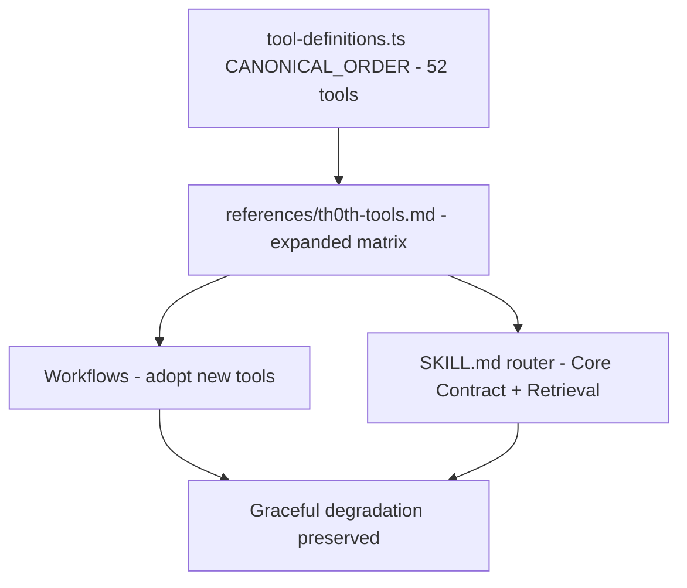

# Workflow Tools Adaptation Design

**Spec**: `.specs/features/workflow-tools-adaptation/spec.md`
**Status**: Draft

---

## Architecture Overview

This feature is a documentation-layer adaptation: it edits `skills/massa-th0th/` workflow files, the `references/th0th-tools.md` tool-contract reference, and the `SKILL.md` router. No tool implementation, MCP schema, or generated artifact changes. The design is a tool-to-workflow adoption map plus a canonical-naming rename pass.

**Approach A (chosen): Single-pass rename + selective adoption.** One atomic sweep replaces all `th0th_*` prefixes with canonical un-prefixed names across workflows/references/SKILL.md, then each workflow adopts the new tools that materially benefit it. Rejected alternative: **Approach B (two-phase)** — rename first, adopt tools in a separate feature. Rejected because the rename and adoption share the same edit surface (every workflow file), so splitting them doubles the touch count and review overhead.

---

## Code Reuse Analysis

### Existing Components to Leverage

| Component | Location | How to Use |
| --- | --- | --- |
| `tool-definitions.ts` CANONICAL_ORDER | `apps/mcp-client/src/tool-definitions.ts:24` | Source of truth for canonical tool names (52 tools, un-prefixed) |
| `massa-th0th-memory` SKILL.md | `skills/massa-th0th-memory/SKILL.md` | Already uses un-prefixed names; reference for naming convention + tool priority table |
| `synapse-usage` SKILL.md | `skills/synapse-usage/SKILL.md` | Documents full Synapse lifecycle (5 moves); reference for synapse_task_begin/end/prefetch adoption |
| `FEATURES.md` tool roster | `FEATURES.md:791-895` | Canonical human-readable tool descriptions for the expanded matrix |
| Existing graceful-degradation table | `skills/massa-th0th/SKILL.md:268-279` | Pattern for new tool fallback rules |

### Integration Points

| System | Integration Method |
| --- | --- |
| Workflows → MCP tools | Tool name references in workflow prose (no code calls) |
| `references/th0th-tools.md` → workflows | Workflows point to it as the single tool-contract reference |
| `SKILL.md` router → workflows | Core Contract + Retrieval sections set the tool surface workflows follow |

---

## Components

### 1. `references/th0th-tools.md` — Expanded Tool Matrix

- **Purpose**: Single source of truth for all 52 tool contracts; workflows reference it instead of duplicating tool details.
- **Location**: `skills/massa-th0th/references/th0th-tools.md`
- **Changes**:
  - Rename all `th0th_*` → un-prefixed in the existing MCP Capability Matrix.
  - Expand the matrix from ~20 rows to all 52 tools, grouped by category (Indexing & Search, Symbol Graph, Memory & Lifecycle, Synapse, Passive Capture, Handoffs, Checkpoints, Proposals, Code Execution, Bootstrap, Fetch).
  - Add rows for: `read_file`, `symbol_snippet`, `get_architecture`, `memory_update`, `memory_delete`, `create_checkpoint`, `list_checkpoints`, `restore_checkpoint`, `compact_snapshot`, `bootstrap`, `handoff_begin`, `handoff_accept`, `handoff_cancel`, `handoff_list_pending`, `list_proposals`, `approve_proposal`, `reject_proposal`, `execute`, `execute_file`, `batch_execute`, `fetch_and_index`, `synapse_get`, `synapse_update`, `synapse_end`, `synapse_prefetch`, `synapse_list`, `synapse_task_begin`, `synapse_task_end`, `rename_project`, `merge_projects`.
  - Update the Retrieval Order to include `read_file`, `symbol_snippet`, `trace_path`, `impact_analysis`, `get_architecture`.
  - Keep the file name `th0th-tools.md` for backward-compat (validator anchors reference it).

### 1a. Full `references/` Tree — Canonical Naming Rename

- **Purpose**: All reference files (not just `th0th-tools.md`) use canonical un-prefixed tool names.
- **Location**: `skills/massa-th0th/references/**/*.md` (~30 files including `synapse-policy.md`, `decision-engine.md`, `codebase-investigation.md`, etc.)
- **Changes**: Replace every `th0th_<tool>` reference with the canonical un-prefixed name. This is part of the T1 rename sweep (Pre-mortem F1 mitigation).

### 2. Workflows — Tool Adoption Map

- **Purpose**: Each workflow adopts the new tools that materially benefit its flow.
- **Location**: `skills/massa-th0th/workflows/`
- **Adoption map** (tool → workflow → where in the flow):

| Tool(s) | Workflow | Insertion point | Rationale |
| --- | --- | --- | --- |
| `bootstrap` | `onboarding.md` | After indexing, before manual `remember` | Idempotent seed-memory generation from git/README/centrality |
| `create_checkpoint` / `list_checkpoints` / `restore_checkpoint` | `spec-driven.md` | Execute: task boundary + resume after interruption | Long-running task save/resume |
| `create_checkpoint` | `long-session.md` | Before compaction/stopping | Session-guide checkpoint backing |
| `create_checkpoint` | `restart-save.md` | After writing `.specs/` files | Milestone checkpoint backing for restart point |
| `compact_snapshot` | `long-session.md` | Before compaction fires | Zero-loss session table-of-contents across /compact |
| `handoff_begin` / `handoff_accept` / `handoff_list_pending` / `handoff_cancel` | `agent-handoff.md` | Persist + resume steps | Structured handoff table (dual-writes searchable memory) |
| `handoff_list_pending` / `handoff_accept` | `restart-load.md` | Resume step | Discover and accept open handoffs |
| `trace_path` | `debug.md` | Root-cause tracing step (step 8-9) | Typed-edge BFS call/data-flow path tracing |
| `impact_analysis` | `architecture/architecture-audit.md` | Impact assessment step | Git-diff → centrality-ranked impact |
| `impact_analysis` | `refactor.md` | Blast-radius assessment | Structural change impact ranking |
| `get_architecture` | `architecture/architecture-audit.md` | Architecture-map entry point | Architecture-specific deep map (packages, routes, hotspots, communities, cycles) |
| `execute_file` | `debug.md` | Large-file analysis step | Run analysis code over a file instead of loading it into context |
| `execute` / `batch_execute` | `general.md` | Analysis step | "Think in code" for derived values / parallel commands |
| `synapse_task_begin` / `synapse_task_end` | `spec-driven.md` | Execute: multi-search investigation | Task envelope within Synapse session |
| `synapse_task_begin` / `synapse_task_end` | `feature.md` | Multi-search investigation | Task envelope within Synapse session |
| `synapse_prefetch` | `spec-driven.md`, `feature.md`, `debug.md` | After opening a file for deep investigation | Warm Synapse buffer before next search |
| `read_file` | All workflows that read files | Replace native Read references where symbol metadata is useful | massa-th0th tool with symbol metadata + imports (priority 14 per meta-skill) |
| `symbol_snippet` | All workflows that need raw code by line range | Where line-range snippets are needed | Raw code snippet by file + line range |
| `memory_update` | `general.md`, `debug.md`, `long-session.md` | When a memory is stale/needs correction | Re-embeds on content change |
| `memory_delete` | `general.md`, `long-session.md` | When a memory is obsolete | Hard-delete with graph-edge severing |
| `analytics` | `general.md`, `long-session.md` | Usage insights step | Search/cache usage patterns and metrics |
| `fetch_and_index` | `exploration.md` | When external docs/API refs are needed | Pull web content into searchable index |

### 3. `SKILL.md` Router — Core Contract + Retrieval

- **Purpose**: Router reflects the full tool surface with canonical names.
- **Location**: `skills/massa-th0th/SKILL.md`
- **Changes**:
  - Core Contract: rename `th0th_recall` → `recall`, `th0th_search` → `search`; add note that the tool surface includes checkpoints, handoffs, bootstrap, compact_snapshot, trace_path, impact_analysis, code execution, full Synapse, read_file, symbol_snippet.
  - Retrieval And Synapse: rename all `th0th_*` → un-prefixed; add `read_file`, `symbol_snippet`, `trace_path`, `impact_analysis`, `synapse_prefetch` to the retrieval order.
  - Session And Project: rename `th0th_recall` → `recall`.
  - Persistence: no `th0th_` references remain.
  - Graceful Degradation: rename `th0th_recall` → `recall`, `th0th_search` → `search`; add rows for checkpoint/handoff/bootstrap/compact_snapshot/execution unavailability.

---

## Canonical Naming Rename Map

Every `th0th_<tool>` reference becomes `<tool>`:

| Old (th0th_-prefixed) | New (canonical) |
| --- | --- |
| `th0th_recall` | `recall` |
| `th0th_remember` | `remember` |
| `th0th_search` | `search` |
| `th0th_optimized_context` | `optimized_context` |
| `th0th_compress` | `compress` |
| `th0th_list_projects` | `list_projects` |
| `th0th_project_map` | `project_map` |
| `th0th_index` | `index` |
| `th0th_index_status` | `index_status` |
| `th0th_reindex` | `reindex` |
| `th0th_search_definitions` | `search_definitions` |
| `th0th_get_references` | `get_references` |
| `th0th_go_to_definition` | `go_to_definition` |
| `th0th_read_file` | `read_file` |
| `th0th_symbol_snippet` | `symbol_snippet` |
| `th0th_memory_list` | `memory_list` |
| `th0th_analytics` | `analytics` |
| `th0th_reset_project` | `reset_project` |
| `th0th_synapse_session` | `synapse_session` |
| `th0th_synapse_prime` | `synapse_prime` |
| `th0th_synapse_access` | `synapse_access` |

---

## Full 52-Tool Roster (from `tool-definitions.ts` CANONICAL_ORDER)

`index`, `index_status`, `search`, `remember`, `recall`, `memory_update`, `memory_delete`, `list_checkpoints`, `create_checkpoint`, `restore_checkpoint`, `compress`, `optimized_context`, `analytics`, `list_projects`, `project_map`, `get_architecture`, `search_definitions`, `get_references`, `go_to_definition`, `trace_path`, `impact_analysis`, `reset_project`, `read_file`, `synapse_session`, `synapse_get`, `synapse_update`, `synapse_end`, `synapse_prime`, `synapse_access`, `synapse_prefetch`, `synapse_list`, `synapse_task_begin`, `synapse_task_end`, `symbol_snippet`, `memory_list`, `reindex`, `hook_ingest`, `compact_snapshot`, `bootstrap`, `handoff_begin`, `handoff_accept`, `handoff_cancel`, `handoff_list_pending`, `list_proposals`, `approve_proposal`, `reject_proposal`, `execute`, `execute_file`, `batch_execute`, `fetch_and_index`, `rename_project`, `merge_projects`.

**Out-of-scope for workflow adoption (with reason):**
- `hook_ingest` — passive-capture ingestion endpoint used by host hook scripts, not agent workflows.
- `rename_project` / `merge_projects` — administrative lifecycle operations, not workflow-recurring tools.
- `reset_project` — already referenced in `onboarding.md` prose (destructive; explicit user intent required); no new adoption needed.

---

## Error Handling Strategy

| Error Scenario | Handling | User Impact |
| --- | --- | --- |
| Tool unavailable (unindexed project, DB down, LLM off) | Workflow falls back to existing pattern (search/get_references/native Read) and records reduced retrieval confidence | Agent continues with degraded retrieval |
| `bootstrap` on a project with no git/README | Degrades to rule-based minimal seeds per its contract | Minimal seed memories; not a failure |
| `create_checkpoint` when `task_checkpoints` table unavailable | Continue with `.specs/` artifact state as fallback | Restart-save/long-session still work via .specs/ |
| `handoff_begin` when `HANDOFFS_ENABLED=false` | Fall back to `remember` + `.specs/` writes | Handoff stored in memory, not handoff table |
| `compact_snapshot` outside a pre-compact hook | Treat returned snapshot as a session-guide pointer | Session guide has a reference pointer |
| `execute_file`/`execute` with untrusted code | Respect local-dev-only trust model | No untrusted-client exposure |
| `impact_analysis` on a clean tree | Returns empty impact set | Not an error; workflow notes no changes to assess |

---

## Risks & Concerns

| Concern | Location (file:line) | Impact | Mitigation |
| --- | --- | --- | --- |
| R1: `th0th_` prefix missed in some file | Any workflow/reference/SKILL.md | Inconsistent naming; tool reference may not resolve | Deterministic sensor: `rg 'th0th_' skills/massa-th0th/` (full tree, not just workflows) must return zero (WTA-01); T1 covers `skills/massa-th0th/**/*.md` (Pre-mortem F1 mitigation) |
| R2: New tool reference breaks graceful degradation | Any workflow adopting a new tool | Workflow hard-fails when tool is absent | Every new tool reference keeps "if unavailable, continue with fallback" pattern (WTA edge cases) |
| R3: `th0th-tools.md` matrix drift from `tool-definitions.ts` | `references/th0th-tools.md` | Workflows reference a stale tool contract | Matrix is built from CANONICAL_ORDER; verification reads `tool-definitions.ts` and compares (WTA-02) |
| R4: Behavior drift — tool adoption changes routing/memory/Evidence Gate | Any rewritten workflow | Workflow contracts change | Tool adoption adds steps or replaces prose; routing/memory/Evidence Gate/failure-handling contracts preserved (WTA-13..15 equivalent) |
| R5: `get_architecture` adopted but tool has different contract than `project_map` | `architecture-audit.md` | Wrong tool usage | `get_architecture` is architecture-specific (packages, routes, hotspots, communities, cycles); `project_map` is general overview; design names both explicitly and T8 instructs the workflow to distinguish them |
| R6: `synapse_task_begin/end` requires an existing `synapse_session` id | `spec-driven.md`, `feature.md` | Task envelope fails if no session | Workflow instructs creating `synapse_session` first (existing pattern); task_begin/end are optional enhancements |
| R7: `compact_snapshot` requires `sessionId` which may not be the `workflowSessionId` | `long-session.md` | Wrong session scoped | `compact_snapshot` takes the lifecycle `sessionId` (from hooks/sessions), NOT the `workflowSessionId`; T7 explicitly disambiguates the two in the workflow prose (Pre-mortem F3 mitigation) |
| R8: Graph tools (`trace_path`, `impact_analysis`, `get_architecture`) called on stale/unindexed project | `debug.md`, `architecture-audit.md`, `refactor.md` | Wrong "no impact" conclusion | T8 adds explicit freshness gate to every graph-tool reference: result only counts as evidence when index is fresh; fall back to `search`/`get_references` otherwise (Pre-mortem F2 mitigation) |

---

## Tech Decisions

| Decision | Choice | Rationale |
| --- | --- | --- |
| Canonical naming = un-prefixed | Remove `th0th_` prefix everywhere | Matches `tool-definitions.ts` CANONICAL_ORDER, OpenCode plugin, and `massa-th0th-memory` meta-skill |
| `th0th-tools.md` file name kept | No rename | Validator anchors reference it; backward-compat |
| Selective adoption, not blanket | Only adopt tools that materially benefit a workflow | Avoids bloating workflows with irrelevant tool references (minimum-code guideline) |
| `read_file` preferred over native Read | Where symbol metadata is useful | `massa-th0th-memory` priority rule (priority 14) |
| Checkpoints adopted in spec-driven/long-session/restart-save | Those workflows describe long-running task save/resume | Checkpoints are the first-class tool for exactly this |
| `trace_path` in debug, not in architecture-audit | Debug needs call-path tracing for root cause; architecture-audit uses `impact_analysis` + `get_architecture` | Each graph tool maps to its strongest workflow fit |
| Approach A (single-pass) over Approach B (two-phase) | Single-pass rename + adoption | Same edit surface; splitting doubles touch count |

> **Project-level decisions:** No new project-level AD needed. This feature is documentation-layer only; no code, DB, migration, or public-contract change.

---

## Verification Design

| Requirement | Verification |
| --- | --- |
| WTA-01 (no `th0th_` prefix) | `rg 'th0th_' skills/massa-th0th/` returns zero matches |
| WTA-02 (expanded matrix) | `references/th0th-tools.md` contains all 52 tools from CANONICAL_ORDER; grep each tool name |
| WTA-03 (SKILL.md canonical) | `rg 'th0th_' skills/massa-th0th/SKILL.md` returns zero |
| WTA-04..07 (checkpoints) | `rg 'create_checkpoint\|list_checkpoints\|restore_checkpoint' skills/massa-th0th/workflows/` returns matches in spec-driven.md, long-session.md, restart-save.md |
| WTA-08..10 (handoffs) | `rg 'handoff_begin\|handoff_accept\|handoff_list_pending\|handoff_cancel' skills/massa-th0th/workflows/` returns matches in agent-handoff.md, restart-load.md |
| WTA-11..12 (bootstrap) | `rg 'bootstrap' skills/massa-th0th/workflows/onboarding.md` returns a match |
| WTA-13..14 (compact_snapshot) | `rg 'compact_snapshot' skills/massa-th0th/workflows/long-session.md` returns a match |
| WTA-15..17 (trace_path/impact_analysis) | `rg 'trace_path' skills/massa-th0th/workflows/debug.md` + `rg 'impact_analysis' skills/massa-th0th/workflows/architecture/ skills/massa-th0th/workflows/refactor.md` return matches |
| WTA-18..19 (code execution) | `rg 'execute_file\|execute\|batch_execute' skills/massa-th0th/workflows/debug.md skills/massa-th0th/workflows/general.md` return matches |
| WTA-20..22 (full Synapse) | `rg 'synapse_task_begin\|synapse_task_end\|synapse_prefetch' skills/massa-th0th/workflows/` return matches in spec-driven.md, feature.md |
| WTA-23..24 (read_file/symbol_snippet) | `rg 'read_file\|symbol_snippet' skills/massa-th0th/workflows/` return matches |
| WTA-25..27 (memory_update/delete/analytics) | `rg 'memory_update\|memory_delete\|analytics' skills/massa-th0th/workflows/` return matches |
| WTA-28..29 (SKILL.md router) | `rg 'checkpoint\|handoff_begin\|bootstrap\|compact_snapshot\|trace_path\|impact_analysis\|execute_file\|synapse_prefetch\|read_file\|symbol_snippet' skills/massa-th0th/SKILL.md` returns matches |
| Behavior preservation | Diff each rewritten workflow: routing header, workflowSessionId rule, reference-load list, recall step, persistence tags, Evidence Gate step unchanged in meaning |

**Discrimination sensor**: inject a `th0th_`-prefixed reference into a scratch copy of one workflow; confirm `rg 'th0th_'` catches it (sensor kills the mutation).

---

## Requirements Traceability

| Requirement ID | Design Component |
| --- | --- |
| WTA-01 | Canonical Naming Rename Map + all components |
| WTA-02 | Component 1: `th0th-tools.md` expanded matrix |
| WTA-03 | Component 3: SKILL.md Core Contract |
| WTA-04..07 | Component 2: checkpoints in spec-driven/long-session/restart-save |
| WTA-08..10 | Component 2: handoff tools in agent-handoff/restart-load |
| WTA-11..12 | Component 2: bootstrap in onboarding |
| WTA-13..14 | Component 2: compact_snapshot in long-session |
| WTA-15..17 | Component 2: trace_path/impact_analysis in debug/architecture-audit/refactor |
| WTA-18..19 | Component 2: code execution in debug/general |
| WTA-20..22 | Component 2: full Synapse in spec-driven/feature |
| WTA-23..24 | Component 2: read_file/symbol_snippet in all workflows |
| WTA-25..27 | Component 2: memory_update/delete/analytics in general/debug/long-session |
| WTA-28..29 | Component 3: SKILL.md Core Contract + Retrieval |