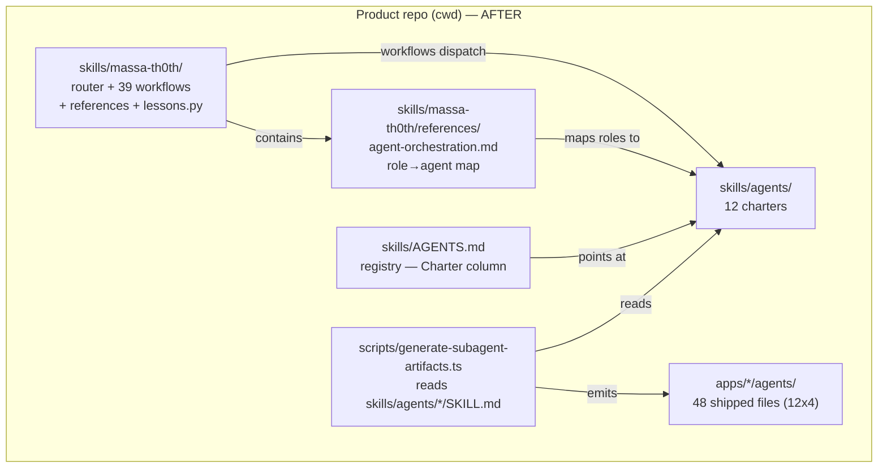

# Workflows + Agents Consolidation Design

**Spec**: `.specs/features/workflows-agents-consolidation/spec.md`
**Context**: `.specs/features/workflows-agents-consolidation/context.md`
**Status**: Draft

---

## Architecture Overview

Consolidate two repos into one tree: move 12 agent charters to `skills/agents/<name>/` and copy the massa-th0th workflow skill to `skills/massa-th0th/` in the product repo, then rewrite all 39 workflows to use named dispatch blocks instead of duplicated inline prompt prose.



### Approach Tradeoffs (Large/Complex)

**Approach A (RECOMMENDED): Phased copy-then-rewrite**
- Phase 1: Move 12 charters → `skills/agents/`, update generator path + registry, regenerate, verify drift gate green.
- Phase 2: Copy massa-th0th skill tree from Useful-Agent-Skills → `skills/massa-th0th/`.
- Phase 3: Rewrite all 39 workflows with dispatch blocks.
- Phase 4: Update agent-orchestration role map + final validation.
- **Pros**: Each phase leaves the repo buildable + drift gate green; easy to bisect; behavior-preserving rewrites happen after structural moves.
- **Cons**: More commits; temporary duplication until Phase 2 lands.

**Approach B: Move-and-rewrite-in-one-pass**
- Move everything and rewrite workflows in one giant commit.
- **Pros**: Fewer commits.
- **Cons**: Drift gate breaks mid-flight; impossible to bisect; 39 workflow rewrites + structural moves in one commit is unreviewable. **Rejected.**

**Approach C: Symlink bridge**
- Keep charters in Useful-Agent-Skills, symlink into product repo.
- **Pros**: No file duplication.
- **Cons**: Symlinks don't survive git clone on all platforms; breaks the "single tree" goal; Useful-Agent-Skills remains a hard dependency. **Rejected.**

**Chosen**: Approach A — phased, each phase green before the next starts.

---

## Code Reuse Analysis

### Existing Components to Leverage

| Component | Location | How to Use |
| --- | --- | --- |
| Generator | `scripts/generate-subagent-artifacts.ts` | Update `loadCharter` path (line 205) from `skills/<name>/` to `skills/agents/<name>/`; everything else unchanged |
| Parity test | `scripts/__tests__/subagent-parity.test.ts` | No changes needed — it reads shipped files from `apps/*/agents/` and runs the generator; doesn't hardcode `skills/` paths |
| Registry | `skills/AGENTS.md` | Update Charter column from `skills/<name>/SKILL.md` to `skills/agents/<name>/SKILL.md` |
| Capability Packet | `references/agent-orchestration.md:74-87` | Dispatch block format reuses this exact contract |
| Role mapping | `skills/AGENTS.md:71-88` | Source of truth for old role → new agent mapping |

### Integration Points

| System | Integration Method |
| --- | --- |
| Generator → charters | `loadCharter` reads `path.join(SKILLS_DIR, "agents", name, "SKILL.md")` |
| Workflows → agents | Named dispatch blocks reference `skills/agents/<name>/SKILL.md` |
| Workflows → references | Relative paths `references/...` still resolve inside `skills/massa-th0th/` after the move |

---

## Components

### skills/agents/ (12 charters)

- **Purpose**: Group the 12 specialist agent charters under one directory.
- **Location**: `skills/agents/<name>/SKILL.md` for each of the 12 specialists.
- **Interfaces**: YAML frontmatter (name, description, metadata.model_hint, metadata.permission) + markdown body.
- **Dependencies**: Generator reads them; workflows dispatch them.
- **Reuses**: Charter content is unchanged (frozen by prior feature).

### skills/massa-th0th/ (workflow skill)

- **Purpose**: The massa-th0th router + workflows + references + lessons script, consolidated into the product repo.
- **Location**: `skills/massa-th0th/SKILL.md`, `skills/massa-th0th/workflows/`, `skills/massa-th0th/references/`, `skills/massa-th0th/scripts/lessons.py`.
- **Interfaces**: Router table in SKILL.md; workflow files; reference files.
- **Dependencies**: Agent charters at `skills/agents/`; generator + parity test in `scripts/`.
- **Reuses**: Full tree copied from Useful-Agent-Skills `skills/massa-th0th/`.

### scripts/generate-subagent-artifacts.ts (path update)

- **Purpose**: Single source of truth for shipped agent files; drift gate.
- **Location**: `scripts/generate-subagent-artifacts.ts` (line 205).
- **Interfaces**: `loadCharter(name)` reads `path.join(SKILLS_DIR, "agents", name, "SKILL.md")`.
- **Dependencies**: `skills/agents/*/SKILL.md`.
- **Reuses**: All emission logic (emitClaude/emitCodex/emitCursor/emitOpenCode) unchanged.

### Dispatch Block Format (new convention)

- **Purpose**: Replace duplicated inline prompt sections in workflows with a compact, reusable dispatch block.
- **Location**: Inside each rewritten workflow file.
- **Format** (compact fenced block, 9-field schema FROZEN per Plan Challenge finding B):

```
> **Dispatch: <agent-name>** — see `skills/agents/<name>/SKILL.md`
> - trigger: <why delegation is justified now>
> - scope: <exact files/modules/symbols>
> - permissions: read-only | write (disjoint write set)
> - inputs: <recalled facts, source pointers, constraints; for architecture-specialist include `lens: domain|coupling|deepening`>
> - sensors: <expected commands or concrete checks>
> - output: <exact output contract>
> - firewall: <raw output that must be summarized, not returned>
> - memory: suggest-only (main agent persists)
```

The 9 required fields are: `trigger`, `scope`, `permissions`, `inputs`, `sensors`, `output`, `firewall`, `memory` (8 listed fields + the `Dispatch: <agent-name>` header). The field-completeness grep asserts each field appears within every dispatch block. For `architecture-specialist`, the `inputs` field MUST include `lens:` to preserve the 3-role fold sub-mode signal (Plan Challenge finding B/R6).

- **Dependencies**: `references/agent-orchestration.md` capability packet contract.
- **Reuses**: Exact fields from `agent-orchestration.md:74-87`.

---

## Error Handling Strategy

| Error Scenario | Handling | User Impact |
| --- | --- | --- |
| Charter missing at `skills/agents/<name>/SKILL.md` | Generator fails with clear error naming the missing file | Drift gate fails CI; fix the path |
| Old role name remains in a workflow | Grep check fails in final validation | Validation report flags the file:line; fix task created |
| Workflow internal reference path breaks after move | Structural check confirms `references/` paths resolve | Validation report flags broken path |
| Generator drift after regeneration | `--check` exits non-zero | Re-run generator, commit the output |

---

## Risks & Concerns

| Concern | Location (file:line) | Impact | Mitigation |
| --- | --- | --- | --- |
| R1: Generator path change misses a reference | `generate-subagent-artifacts.ts:205` | Drift gate breaks | T2 updates the single `loadCharter` path; parity test confirms 48 files match |
| R2: Old role names survive in a workflow | Any of the 39 workflow files | Dispatch blocks reference non-existent charters | T15 runs `rg 'implementer\|verifier\|domain-mapper\|coupling-auditor\|deepening-architect'` — must return 0 hits |
| R3: Internal reference paths break after skill move | `skills/massa-th0th/workflows/*.md` | Workflows can't load references | T3 copies the tree as a unit; relative paths `references/...` still resolve |
| R4: Registry Charter column not updated | `skills/AGENTS.md:56-67` | Generator can't find charters | T2 updates the column in the same task as the generator path |
| R5: Behavior drift during rewrite | Any rewritten workflow | Routing/memory/Evidence Gate contracts change | T15 verifies routing headers, finding-ID prefixes, severity rules, and Evidence Gate steps unchanged in meaning |
| R6: architecture-specialist 3-role fold loses sub-mode | Workflows dispatching `architecture-specialist` | Specialist doesn't know which lens (domain/coupling/deepening) to run | Dispatch block `inputs` field names the lens sub-mode explicitly |
| R7: `lessons.py` relative paths break after move | `skills/massa-th0th/scripts/lessons.py` | Lessons commands fail | T3 copies the script as part of the skill unit; script uses `--root .` not internal paths |

---

## Tech Decisions

| Decision | Choice | Rationale |
| --- | --- | --- |
| AD-WAC-001: Destination = product repo | cwd | User confirmed |
| AD-WAC-002: Agent dir = `skills/agents/` | Group 12 charters | User confirmed; separates agents from the workflow skill |
| AD-WAC-003: Workflow skill path = `skills/massa-th0th/` | Full skill tree | User confirmed |
| AD-WAC-004: Meta-skills stay at `skills/` top level | `massa-th0th-memory`, `synapse-usage` | Generator already excludes them; moving breaks meta-skill references |
| AD-WAC-005: Dispatch block = blockquote fenced format | Compact, scannable, matches capability packet | Reuses `agent-orchestration.md` contract |
| AD-WAC-006: `plan-critic`/`furps-analyst`/`handoff-writer` stay role-based | No charter exists | Prompt-contract dispatch per `agent-orchestration.md` |
| AD-WAC-007: Useful-Agent-Skills source left untouched | User decides its lifecycle | This feature copies, doesn't delete |

> **Project-level decisions:** All decisions here are feature-local. No new `AD-NNN` entry needed in `.specs/project/STATE.md` — this feature conforms to existing active decisions (AD-004 through AD-009 are about the TS runtime, not skill structure).

---

## Verification Design

| High-Risk Requirement | Verification Path |
| --- | --- |
| WAC-03/04: Drift gate green after path change | `bun run scripts/generate-subagent-artifacts.ts --check` exits 0 |
| WAC-04: Parity test passes | `bun test scripts/__tests__/subagent-parity.test.ts` — all describes pass |
| WAC-08: No old role names remain | `rg 'implementer\|verifier\|domain-mapper\|coupling-auditor\|deepening-architect' skills/massa-th0th/workflows/` returns 0 hits |
| WAC-06/07: Dispatch blocks present | `rg 'Dispatch:' skills/massa-th0th/workflows/{architecture,security,requirements,tests,bugs,code-quality,implementation}/` returns ≥14 hits (7 audit + 7 fix) |
| WAC-09: Dispatch block field completeness (finding B) | T15 field-completeness grep: every `Dispatch:` block has all 8 listed fields; every `architecture-specialist` dispatch has `lens:` in inputs |
| WAC-02: Reference copy complete (finding C) | T4 `diff -rq` reference-equality check empty + pinned file count 123 |
| WAC-02: No stale state files (finding E) | T4 post-copy purge gate: `find skills/massa-th0th -name '*.pyc' -o -name '__pycache__'` returns 0 |
| WAC-13/14/15: Behavior preservation | Manual diff review: routing headers, finding-ID prefixes, severity rules, Evidence Gate steps unchanged in meaning |
| Type-check still passes | `bun run type-check` exits 0 (generator is TS) |
| Isolation checkpoint (structural) | T15 runs parity test to isolate move-blame from rewrite-blame |

Ran a read-only `plan-critic` subagent in `pre_mortem` mode with a bounded critique packet. 5 findings returned (3 high, 2 medium); confidence dropped 0.70→0.45.

| Finding | Severity | Status | Resolution |
| --- | --- | --- | --- |
| A: lessons.py path break after move | high | **Falsified by source inspection** | `lessons.py:537` uses `--root .` (default current dir) + relative `.specs/lessons.json`; NOT `__file__`-relative. No path break on move. T5 adds an empirical smoke test to confirm. |
| B: Dispatch blocks pass greps but lack required fields | high | **Revised into plan** | Frozen the 9-field schema in design.md; T15 adds field-completeness grep + `architecture-specialist` `lens:` check; T17 adds a missing-`lens:` discrimination sensor. |
| C: Reference copy drops a nested file silently | high | **Revised into plan** | T4 adds `diff -rq` reference-equality check + pinned exact file count (124 source, 123 after `__pycache__` exclusion). |
| D: Generator exclusion predicate breaks | medium | **Falsified by source inspection** | Generator uses a hardcoded `SPECIALIST_NAMES` array (line 34), not a directory scan. No exclusion logic exists to break. The path change is a pure 1-line edit. |
| E: Stale state files copied in | medium | **Partially confirmed** | Source tree contains `scripts/__pycache__/lessons.cpython-314.pyc`. T4 adds a post-copy purge gate. |

Structural recommendation (isolation checkpoint) accepted: T15 runs the parity test as an isolation checkpoint between the move and the rewrite signal.

**Synthesis**: 2 of 5 findings revised into the plan (B, C + E partial); 2 falsified by source inspection (A, D); 1 partially confirmed (E). Plan confidence recovered to ~0.72 after revisions.